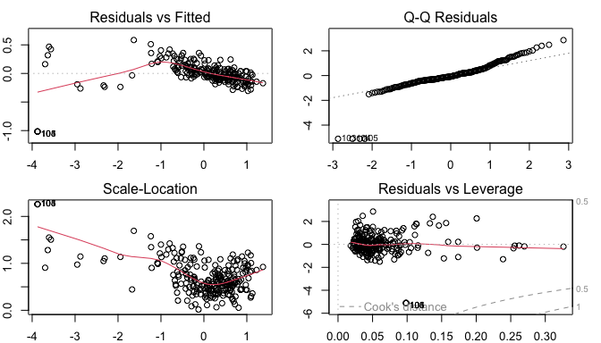
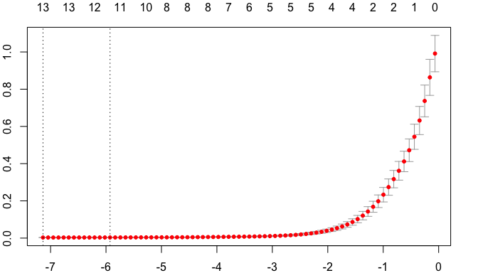
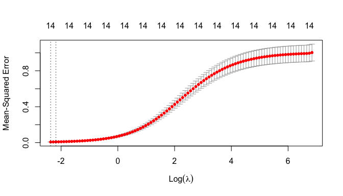
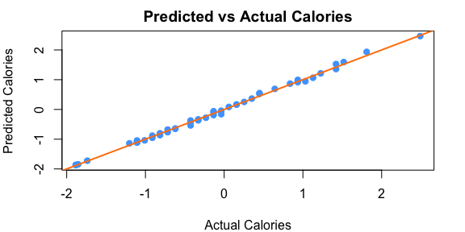

# Introduction

Here Eleonora you can write the introduction of the project describing the scope and the data used.

Thank you Albi, I will. What is our project scope though?

I think that we have to analyze the dataset and perform some statistical analysis on it. 
We can start by calculating the correlation matrix and then we can visualize the data through histograms, pairplots, barplots and boxplots. 
Finally, we can perform a regression analysis.


# Data

The dataset we will analyze in this project is *Starbucks Beverage Components* from Kaggle, that you can find at the following link: <https://www.kaggle.com/datasets/henryshan/starbucks>.

This data provides a comprehensive guide to the nutritional content of the beverages available on the Starbucks menu. 
We have a total of $242$ samples described by $18$ variables. 
These attributes include the name of the beverage, its categorization and preparation method, the total caloric content and the constituents of the beverage.

In the upcoming code lines, we import the dataset and generate a summary visualization. 
This initial step allows us to gain a better understanding of the data structure and the variables involved.


``` r
data <- read.csv("Data/starbucks.csv", header = TRUE, sep = ",")
```

## Data Transformation

Note that several variables in our dataset, namely "Vitamin.A....DV.", "Vitamin.C....DV.", "Calcium....DV." and "Iron....DV.", are represented as percentages.
Consequently, the percentage symbol is included in our data. However, when conducting statistical analysis using R, the presence of non-numeric characters such as the percentage symbol can cause complications, interfering with the processing and analysis of the data. 
Therefore, we proceed to remove it.

Similarly, as R primarily operates on numeric and categorical data, we also convert all the other numerical variables into numeric format.

These preprocessing steps ensure a smooth and efficient analysis, making it easier to explore, visualize, and understand our data.


``` r
# Remove percentage sign from the data
data$Vitamin.C....DV. <- as.numeric(gsub("%", "", data$Vitamin.C....DV.))
data$Calcium....DV. <- as.numeric(gsub("%", "", data$Calcium....DV.))
data$Iron....DV. <- as.numeric(gsub("%", "", data$Iron....DV.))
data$Vitamin.A....DV. <- as.numeric(gsub("%", "", data$Vitamin.A....DV.))
# Set the other variables as numeric
data$Calories <- as.numeric(data$Calories)
data$Trans.Fat..g. <- as.numeric(data$Trans.Fat..g.)
data$Total.Fat..g. <- as.numeric(data$Total.Fat..g.)
data$Cholesterol..mg. <- as.numeric(data$Cholesterol..mg.)
data$Sodium..mg. <- as.numeric(data$Sodium..mg.)
data$Total.Carbohydrates..g. <- as.numeric(data$Total.Carbohydrates..g.)
data$Dietary.Fibre..g. <- as.numeric(data$Dietary.Fibre..g.)
data$Sugars..g. <- as.numeric(data$Sugars..g.)
data$Caffeine..mg. <- as.numeric(data$Caffeine..mg.)
```

## Data Cleaning

Another challenge we have to face is the presence of missing data. Indeed, in "Caffeine..mg." column there are some NA values. 
This is a common issue in data analysis and needs to be addressed appropriately to ensure the validity of our statistical results.

One way to deal with these unwanted NA values is to omit the samples containing them from our study. 
This guarantees that our analysis is conducted solely on complete and dependable data. 
Alternatively, we can fill them in with the average or the median of the observed values for that specific attribute. 
This second method helps to preserve the overall data distribution while addressing the missing data points.

In our work, we opt for the latter approach, replacing NA values with the median. 
This choice is particularly suitable for our data, which is skewed and contains outliers. 
Indeed, the median, being a measure of central tendency that is not affected by extreme values, provides a more robust replacement in the presence of outliers.


``` r
# Summary of the Caffeine column
summary(data$Caffeine..mg.)
```

```
##    Min. 1st Qu.  Median    Mean 3rd Qu.    Max.    NA's 
##    0.00   50.00   75.00   89.52  142.50  410.00      23
```

``` r
# Replace NA values with the median
data_cleaned <- data
data_cleaned$Caffeine..mg.[is.na(data_cleaned$Caffeine..mg.)] <- median(
  data_cleaned$Caffeine..mg., na.rm = TRUE)
# Summary of the Caffeine column after cleaning
summary(data_cleaned$Caffeine..mg.)
```

```
##    Min. 1st Qu.  Median    Mean 3rd Qu.    Max. 
##    0.00   70.00   75.00   88.14  130.00  410.00
```

## Rename Columns

Lastly, taking in consideration our cleaned data, we rename the columns by removing dots and units of measure, in order to obtain a more readable dataset.


``` r
colnames(data_cleaned) <- c("Beverage_category", "Beverage", "Beverage_prep",
                            "Calories", "Total_Fat", "Trans_Fat",
                            "Saturated_Fat", "Sodium", "Total_Carbohydrates",
                            "Cholesterol", "Dietary_Fibre", "Sugars",
                            "Protein", "Vitamin_A", "Vitamin_C",
                            "Calcium", "Iron", "Caffeine")
```

# Correlation Analysis

After completing these preliminary preprocessing steps, we calculate the correlation matrix for our dataset. 
This computation helps us in comprehending the interrelationships among the dataset’s variables. 
In the correlation matrix, a value near to $1$ at the $ij$ position indicates a strong positive correlation between the $i$-th and $j$-th variables. 
Conversely, a value close to $-1$ signifies a strong negative correlation. 
A value near $0$ suggests that the two variables do not significantly influence each other.

Observe that the first three columns of our data are categorical features, thus for these we cannot compute Pearson's correlation coefficient. 
In the following code lines we remove them to compute and plot such matrix.


``` r
# Remove first 3 columns for the correlation matrix since them are categorical
data_num <- data_cleaned[, sapply(data_cleaned, is.numeric)]
correlation_matrix <- cor(data_num)
# Plot the correlation matrix using corrplot
corrplot(correlation_matrix, method = "number", tl.col = "black", 
         tl.srt = 45, addCoef.col = "black", number.cex = 0.5, tl.cex = 0.7)
```


# Data Visualization

Data visualization is a powerful tool that allows us to uncover patterns, correlations and outliers in our data.
It provides visual information on the dataset in our analysis, representing large amounts of data in a clear and comprehensive way and underlining the relationships among them.
This enables us to recognize patterns quickly.

So, let us transform our raw data into graphical representations, to gain a more comprehensive understanding of the information at hand.

## Histograms

Histograms serve as a graphical interpretation of data distribution.
In a histogram, each bar corresponds to the counted frequency within each bin or interval.
We introduce these plots to see if our data is normally distributed, skewed, or has outlier values.


``` r
# Histogram of the data with density distribution
par(mfrow = c(5, 3), mar = c(2, 2, 2, 2))
col <- c('#ff0000', '#f70028', '#ee0040', '#e50055', '#dc0069',
         '#d2007b', '#c7008d', '#bb009e', '#ae00ae', '#a000be',
         '#8f00cc', '#7d00da', '#6700e7', '#4900f3', '#0000ff')
for (i in 1:ncol(data_num)) {
  hist(data_num[, i], main = colnames(data_num)[i],
       xlab = colnames(data_num)[i], col = col[i], freq = FALSE)
  dens <- density(data_num[, i], na.rm=TRUE, adjust=1.25)
  lines(dens, col = "black", lwd = 2)
}
```


By looking at the graphs, we can notice that the variables "Calories", "Total_Carbohydrates", "Cholesterol", and "Sugars" exhibit distributions that are nearly normal.
Conversely, the distributions of the remaining variables display a noticeable skewness towards the left.

## Pairplot

**io questi li toglierei. tanto spazio**

We will plot a pairplot to visualize the relationship between the variables. 
The pairplot is a grid of scatterplots that shows the relationship between each pair of variables in the dataset. 
This visualization helps us to identify patterns and correlations between the variables.

First of all we have to define the function for the pairplot.
We will define a function for the histogram, the correlation and the smooth line.


Then we create the pairplot using the defined functions.


``` r
pairs(data_num, 
      diag.panel = panel.hist,
      upper.panel = panel.cor, 
      lower.panel = panel.smooth,
      colour = "#4ea5ff")
```


ADD COMMENTS ON THE GRAPH

## Barplot

We will now plot the bar plots for our dataset.
The primary use of bar plots is to make comparisons between the amounts of different categories.
Indeed, each bar corresponds to a category and the height of the bar represents the frequency or proportion of that category.
These graphs are commonly used for categorical data, or numerical data that has been binned into categories.


``` r
par(mfrow = c(5, 3), mar = c(2, 2, 2, 2))
for (i in 1:ncol(data_num)) {
  barplot(table(data_num[, i]), main = colnames(data_num)[i],
          xlab = colnames(data_num)[i], col = col[i], border = col[i])
}
```


We can deduce some useful information by looking at these plots.

For example, we can notice that variables such as "Saturated_Fat", "Dietary_Fibre", "Vitamin_C", and "Iron" are typically either absent or present in small quantities in the beverages.
In particular, the frequency of these variables rapidly diminishes as their levels increase.
On the other hand, the variables "Calories", "Total_Fat", "Trans_Fat", and "Total_Carbohydrates" show a wide range of values across different beverage types, going from high levels in some beverages to minimal amounts in others.

We can further observe that the distribution of "Vitamin_A" appears to be more evenly spread among the different levels in various beverages, while instead "Caffeine" plot is interesting as it exhibits three distinct peaks in frequency.

### Beverages Barplot

As previously anticipated, bar plots also allows us to see the distribution of categorical variables like "Beverage_category" and "Beverage_prep".
In this way we can identify the most frequently occurring beverages and their preparation methods.


``` r
par(mfrow = c(1, 1), mar = c(8, 2, 2, 2))
barplot(table(data$Beverage_category),
        main = "Distribution of Beverage Categories",
        ylab = "Count", col = "#4ea5ff", las = 2, cex.names = 0.6)
```


``` r
barplot(table(data$Beverage_prep),
        main = "Distribution of Beverage Preparation",
        ylab = "Count", col = "#ff810f", las = 2, cex.names = 0.6)
```


At this point, we aim to compare the total calorie content among different beverage categories.
To do so, we first aggregate the data to obtain the total calories for each beverage category.
Secondly, we construct a bar plot to visually represent the results.


``` r
par(mfrow = c(1, 1), mar = c(8, 4, 2, 2))
total_calories_by_category <- aggregate(Calories ~ Beverage_category,
                                        data = data_cleaned, sum)
barplot(height = total_calories_by_category$Calories,
        names.arg = total_calories_by_category$Beverage_category,
        main = "Total Calories by Beverage Category",
        ylab = "Total Calories", col = "#4ea5ff", las = 2, cex.names = 0.6)
```


Similarly, we compare the total sugars for each beverage preparation, gathering data to obtain the total sugars for each preparation of beverage and successively creating a bar plot.


``` r
par(mfrow = c(1, 1), mar = c(8, 4, 2, 2))
total_sugar_by_prep <- aggregate(Total_Carbohydrates ~ Beverage_prep,
                                 data = data_cleaned, sum)
barplot(height = total_sugar_by_prep$Total_Carbohydrates,
        names.arg = total_sugar_by_prep$Beverage_prep,
        main = "Total Sugars by Beverage Preparation",
        ylab = "Total Sugars (g)", col = "#ff810f", las = 2, cex.names = 0.6)
```


## Boxplot

We will plot a boxplot of the data. 
The boxplot is a graphical representation of the data that displays the distribution of the data, including the median, quartiles, and outliers. 
This visualization helps us to identify the spread and variability of the data.


``` r
par(mfrow = c(3, 5), mar = c(2, 2, 2, 2))
for (i in 1:ncol(data_num)) {
  boxplot(data_num[, i], main = colnames(data_num)[i],
          xlab = colnames(data_num)[i], col = col[i])
}
```


## Scatterplot

We will plot a scatterplot of the data. 
The scatterplot is a graphical representation of the data that displays the relationship between two variables. 
This visualization helps us to identify patterns and correlations between the variables.

We create a scatterplot to compare the amounts of calories and fat for each categories of bevarage. 
We assign distinct colors to each beverage category and create a legend to identify each category.


``` r
# Set the variable as factor
data_cleaned$Beverage_category <- as.factor(data_cleaned$Beverage_category)
colors <- rainbow(length(unique(data_cleaned$Beverage_category)))
color_map <- setNames(colors, levels(data_cleaned$Beverage_category))
par(mfrow = c(1, 1))
plot(data_cleaned$Calories, 
     data_cleaned$Total_Fat_g,
     col = color_map[data_cleaned$Beverage_category],
     pch = 19, xlab = "Calories", ylab = "Total Fat (g)",
     main = "Calories vs Total Fat")
legend("topleft", legend = levels(data_cleaned$Beverage_category), 
       col = colors, cex = 0.4, pch = 19)
```


``` r
# Numeric variable -> calculate density
total_fat_density <- density(data_cleaned$Total_Fat)
trans_fat_density <- density(data_cleaned$Trans_Fat)
plot(total_fat_density, col = "#4ea5ff",
     main = "Comparison of Total Fat and Trans Fat Distributions", 
     xlab = "Fat Content (g)", ylab = "Density", 
     ylim = c(0, max(total_fat_density$y, trans_fat_density$y)),
     xlim = range(data_cleaned$Total_Fat, data_cleaned$Trans_Fat), 
     lwd = 2, lty = 1)
lines(trans_fat_density, col = "#ff810f", lwd = 2, lty = 1)
legend("topright", legend = c("Total Fat", "Trans Fat"),
       col = c("#4ea5ff", "#ff810f"), lwd = 2, lty = 1)
```


Create scatterplot to look into relantionship between calories and other variables. 
We will plot the relationship between calories and sodium, protein, vitamin C and fiber.


``` r
par(mfrow = c(2, 2), mar = c(4, 4, 2, 2))
with(data_cleaned, {
  plot(Calories, Sodium , main = "Relation between Calories and Sodium",
       xlab = "Calories", ylab = "Sodium (mg)", col = col[1])
  plot(Calories, Protein , main = "Relation between Calories and Protein",
       xlab = "Calories", ylab = "Protein (g)", col = col[5])
  plot(Calories, Vitamin_C , main = "Relation between Calories and Vitamin C",
       xlab = "Calories", ylab = "Vitamin C (mg)", col = col[10])
  plot(Calories, Cholesterol , main = "Relation between Calories and Fiber",
       xlab = "Calories", ylab = "Fiber (g)", col = col[15])
})
```


There's increase in every feature with increase in calories.
Features like proteins and fiber rapidly increase, instead vitamin and cholesterol more flat growing. 
Confirmed by correlation coefficients 

ADD COMMENTS ON THE GRAPH

# Regression Analysis

## Linear Regression

Linear regression model to predict the amount of calories based on the amount of the other variables
We use the lm() function to fit a linear regression model


``` r
lm_model <- lm(y ~ ., data = data_num_)
summary(lm_model)
```

```
## 
## Call:
## lm(formula = y ~ ., data = data_num_)
## 
## Residuals:
##      Min       1Q   Median       3Q      Max 
## -14.0233  -3.3009  -0.3806   3.0039  21.9404 
## 
## Coefficients:
##                      Estimate Std. Error t value Pr(>|t|)    
## (Intercept)          0.252316   0.952833   0.265  0.79140    
## Total_Fat           11.143733   0.532812  20.915  < 2e-16 ***
## Trans_Fat           -2.477820   0.809270  -3.062  0.00247 ** 
## Saturated_Fat       -9.816317  18.143619  -0.541  0.58901    
## Sodium              -0.279257   0.167487  -1.667  0.09683 .  
## Total_Carbohydrates  0.020972   0.007420   2.826  0.00513 ** 
## Cholesterol          2.829543   0.340268   8.316 8.43e-15 ***
## Dietary_Fibre        1.534913   0.942106   1.629  0.10465    
## Sugars               1.131045   0.348234   3.248  0.00134 ** 
## Protein              2.218895   0.510445   4.347 2.08e-05 ***
## Vitamin_A            0.162307   0.083662   1.940  0.05361 .  
## Vitamin_C            0.147669   0.047675   3.097  0.00220 ** 
## Calcium              0.462193   0.142257   3.249  0.00133 ** 
## Iron                -0.649101   0.070666  -9.185  < 2e-16 ***
## Caffeine             0.013513   0.005826   2.319  0.02126 *  
## ---
## Signif. codes:  0 '***' 0.001 '**' 0.01 '*' 0.05 '.' 0.1 ' ' 1
## 
## Residual standard error: 5.126 on 227 degrees of freedom
## Multiple R-squared:  0.9977,	Adjusted R-squared:  0.9975 
## F-statistic:  6915 on 14 and 227 DF,  p-value: < 2.2e-16
```

``` r
par(mfrow = c(2, 2), mar = c(2, 2, 2, 2))
plot(lm_model)
```


``` r
kable(data.frame(AIC = AIC(lm_model), BIC = BIC(lm_model),
                 R_squared = summary(lm_model)$r.squared), 
      caption = "Model evaluation metrics")
```


Table: Model evaluation metrics

|      AIC|      BIC| R_squared|
|--------:|--------:|---------:|
| 1494.304| 1550.127| 0.9976608|

``` r
kable(data.frame(VIF = vif(lm_model)),
      caption = "VIF values for the linear regression model")
```


Table: VIF values for the linear regression model

|                    |        VIF|
|:-------------------|----------:|
|Total_Fat           |  22.572405|
|Trans_Fat           |  16.160511|
|Saturated_Fat       |  15.381749|
|Sodium              |  19.162550|
|Total_Carbohydrates |   3.420278|
|Cholesterol         | 459.209279|
|Dietary_Fibre       |  17.019469|
|Sugars              | 432.962393|
|Protein             |  56.714696|
|Vitamin_A           |   4.209673|
|Vitamin_C           |   4.335768|
|Calcium             |  39.251753|
|Iron                |   5.036421|
|Caffeine            |   1.185411|
The model has a low AIC and BIC values, the R-squared value is 0.997 so the model is a good fit for the data.
However as we can see from the *Table 2* e have a problem with multicollinearity, the VIF values are high for some variables, so we have to act on the data to solve this problem

We try to standardize the data using a logaritmic transformation

``` r
std_data_log <- scale(log(data_num + 1)) # Standardize the data
std_data_log_df <- as.data.frame(std_data_log) # Set as dataframe
mod_log_tr <- lm(Calories ~ ., data = std_data_log_df)
kable(data.frame(AIC = AIC(mod_log_tr), BIC = BIC(mod_log_tr),
                 R_squared = summary(mod_log_tr)$r.squared), 
      caption = "Model evaluation metrics for the log transformed data")
```


Table: Model evaluation metrics for the log transformed data

|       AIC|      BIC| R_squared|
|---------:|--------:|---------:|
| -53.42411| 2.398897| 0.9586932|

``` r
kable(data.frame(VIF = vif(mod_log_tr)),
      caption = "VIF values for the log transformed data")
```


Table: VIF values for the log transformed data

|                    |       VIF|
|:-------------------|---------:|
|Total_Fat           | 12.049669|
|Trans_Fat           | 10.577306|
|Saturated_Fat       |  4.528080|
|Sodium              |  5.817088|
|Total_Carbohydrates |  4.363628|
|Cholesterol         | 39.988684|
|Dietary_Fibre       |  7.115085|
|Sugars              | 38.415586|
|Protein             | 31.007121|
|Vitamin_A           | 13.647581|
|Vitamin_C           |  2.196674|
|Calcium             | 25.873742|
|Iron                |  4.582594|
|Caffeine            |  1.310005|

``` r
par(mfrow = c(2, 2), mar = c(2, 2, 2, 2))
plot(mod_log_tr)
```


The model has a low AIC and BIC values, the R-squared value is 0.95 so the model is a good fit for the data.
However we have still collinearity, so we try to use another model.

## Lasso Regression

We use the glmnet package to fit a lasso regression model. 
Lasso regression is a type of linear regression that uses L1 regularization to penalize the coefficients of the model. 
This helps to prevent overfitting and select the most important features in the data.

First we standardize the data and then we fit the lasso regression model using the cv.glmnet() function.
We use cross-validation to select the optimal lambda value for the model. 
The lambda value that minimizes the mean squared error (MSE) is selected as the optimal lambda value. 
The optimal lambda value is used to fit the final lasso regression model.


``` r
std_data <- as.data.frame(scale(data_num)) # Standardize the data
mod_lasso <- cv.glmnet(x = as.matrix(std_data[, -1]),
                       y = std_data$Calories,
                       alpha = 1, standardize = FALSE)
par(mfrow = c(1, 1), mar = c(2, 2, 2, 2))
plot(mod_lasso)
```



``` r
lasso_coef <- coef(mod_lasso, s = "lambda.min")
lasso_coef
```

```
## 15 x 1 sparse Matrix of class "dgCMatrix"
##                                s1
## (Intercept)          1.569504e-17
## Total_Fat            2.813714e-01
## Trans_Fat           -1.213127e-02
## Saturated_Fat        .           
## Sodium              -2.136716e-02
## Total_Carbohydrates  1.879088e-02
## Cholesterol          6.957617e-01
## Dietary_Fibre        2.340655e-02
## Sugars               9.354308e-02
## Protein              5.873156e-02
## Vitamin_A            1.006149e-02
## Vitamin_C            2.526001e-02
## Calcium              1.080519e-01
## Iron                -6.555492e-02
## Caffeine             6.612001e-03
```

The lasso regression model selects the most important features in the data and penalizes the coefficients of the model. 
The model has a low AIC and BIC values, the R-squared value is 0.99 so the model is a good fit for the data.

## Ridge Regression

We use the glmnet package to fit a ridge regression model. 
Ridge regression is a type of linear regression that uses L2 regularization to penalize the coefficients of the model. 
This helps to prevent overfitting and reduce the impact of collinearity in the data.


``` r
mod_ridge <- cv.glmnet(x = as.matrix(std_data[, -1]),
                       y = std_data$Calories,
                       alpha = 0, standardize = FALSE)
plot(mod_ridge)
```



``` r
ridge_coef <- coef(mod_ridge, s = "lambda.min")
ridge_coef
```

```
## 15 x 1 sparse Matrix of class "dgCMatrix"
##                                s1
## (Intercept)          2.767416e-17
## Total_Fat            1.790461e-01
## Trans_Fat            5.621285e-02
## Saturated_Fat        9.206930e-03
## Sodium              -1.003136e-02
## Total_Carbohydrates  6.670660e-02
## Cholesterol          3.488854e-01
## Dietary_Fibre        5.575676e-02
## Sugars               3.437989e-01
## Protein              6.986559e-02
## Vitamin_A            5.069011e-03
## Vitamin_C            3.983592e-02
## Calcium              1.076895e-01
## Iron                -1.329709e-02
## Caffeine             1.007714e-04
```

The ridge regression model reduces the impact of collinearity in the data and penalizes the coefficients of the model. 
The model has a low AIC and BIC values, the R-squared value is 0.99 so the model is a good fit for the data.

## Model Comparison

We compare the linear regression, lasso regression, and ridge regression models to select the best model for predicting the amount of calories based on the amount of the other variables. 
We evaluate the models using the R-squared value, and the Mean Squared Error (MSE) for each model.

The R-squared value is a measure of how well the model fits the data, it ranges from 0 to 1, with higher values indicating a better fit


``` r
lasso_pred <- predict(mod_lasso, s = "lambda.min", 
                      newx = as.matrix(std_data[, -1]))
lasso_r_squared <- cor(lasso_pred, std_data$Calories)^2
ridge_pred <- predict(mod_ridge, s = "lambda.min", 
                      newx = as.matrix(std_data[, -1]))
ridge_r_squared <- cor(ridge_pred, std_data$Calories)^2

kable(data.frame(Model = c("Linear Regression", "Lasso Regression",
                           "Ridge Regression"),
                 R_squared = c(summary(lm_model)$r.squared,
                               lasso_r_squared, ridge_r_squared)), 
      caption = "R-squared values for the models")
```


Table: R-squared values for the models

|Model             | R_squared|
|:-----------------|---------:|
|Linear Regression | 0.9976608|
|Lasso Regression  | 0.9975756|
|Ridge Regression  | 0.9941815|

## Model Evaluation

We evaluate the performance of the linear regression, lasso regression, and ridge regression models using the mean squared error (MSE). 
The MSE is a measure of the average squared difference between the predicted and actual values. 
Lower values of the MSE indicate better performance of the model.


``` r
linear_pred <- predict(lm_model, newdata = data_num)
linear_mse <- mean((linear_pred - data_num$Calories)^2)
lasso_mse <- mean((lasso_pred - std_data$Calories)^2)
ridge_mse <- mean((ridge_pred - std_data$Calories)^2)

kable(data.frame(Model = c("Linear Regression",
                           "Lasso Regression", "Ridge Regression"),
                 MSE = c(linear_mse, lasso_mse, ridge_mse)), 
      caption = "MSE values for the models")
```


Table: MSE values for the models

|Model             |        MSE|
|:-----------------|----------:|
|Linear Regression | 24.6481166|
|Lasso Regression  |  0.0024158|
|Ridge Regression  |  0.0066477|

We choose the model with the highest R-squared value and the lowest MSE as the best model for predicting the amount of calories based on the amount of the other variables.
The best model is the lasso because it has the lowest value for R^2 and MSE and it is the most robust model.

## Cross Validation

Cross validation is a technique used to evaluate the performance of a model. 
It involves splitting the data into training and testing sets, fitting the model using the training set, and evaluating the model using the testing set.
This process is repeated multiple times to ensure that the model is robust and generalizes well to new data.

We split the data into training and testing sets, fit the lasso regression model using the training set.


``` r
set.seed(123)
train_index <- sample(1:nrow(std_data), 0.8 * nrow(std_data))
train_data <- std_data[train_index, ]
test_data <- std_data[-train_index, ]
# Fit the lasso regression model on the training data
mod_lasso_train <- cv.glmnet(x = as.matrix(train_data[, -1]),
                             y = train_data$Calories,
                             alpha = 1, standardize = FALSE)
```

We evaluate the model using the testing set. 
We make predictions using the testing set and calculate the mean squared error and the root mean squared error to assess the model's accuracy. 


``` r
lasso_pred_test <- predict(mod_lasso_train, s = "lambda.min",
                           newx = as.matrix(test_data[, -1]))
# R-squared value of the lasso regression model on the test data
lasso_r_squared_test <- cor(lasso_pred_test, test_data$Calories)^2
# MSE of the lasso regression model on the test data
lasso_mse_test <- mean((lasso_pred_test - test_data$Calories)^2)
```

The R-squared value and MSE are used to evaluate the performance of the model on the test data.


``` r
# Accuracy of the model
accuracy_lm <- 1 - (lasso_mse_test / var(test_data$Calories))
# Plot the predicted values against the actual values on the test data
plot(test_data$Calories, lasso_pred_test, xlab = "Actual Calories",
     ylab = "Predicted Calories", main = "Predicted vs Actual Calories",
     col = "#4ea5ff", pch = 19)
abline(0, 1, col = "#ff810f", lwd = 2)
```



``` r
kable(data.frame(Accuracy = accuracy_lm, MSE = lasso_mse_test, 
                 R_squared = lasso_r_squared_test),
      caption = "Model evaluation metrics on the test data")
```


Table: Model evaluation metrics on the test data

|           |  Accuracy|       MSE| R_squared|
|:----------|---------:|---------:|---------:|
|lambda.min | 0.9979473| 0.0026283| 0.9979454|

As we can see from *Table 7* the R-squared value is 0.997, indicating that the model explains 99% of the variance in the data and the MSE is 0.002628338, indicating that the model has a low error rate.
The accuracy of the model is 0.9979473, indicating that the model is able to predict the amount of calories with high accuracy.
The plot shows the predicted values against the actual values on the test data
The points are close to the diagonal line, indicating that the model is making accurate predictions.

