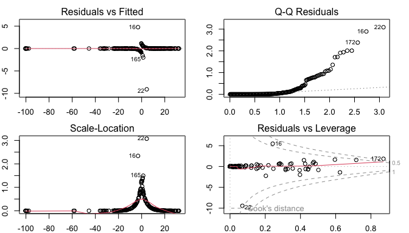
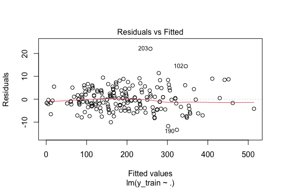
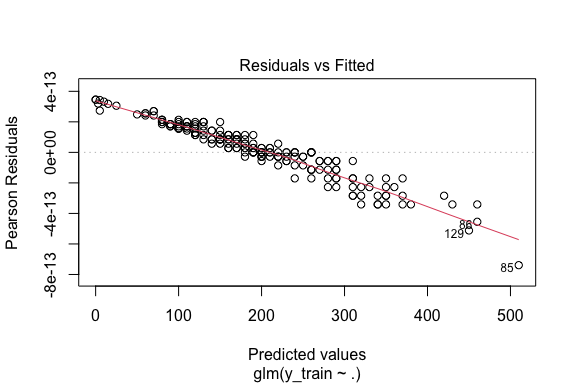
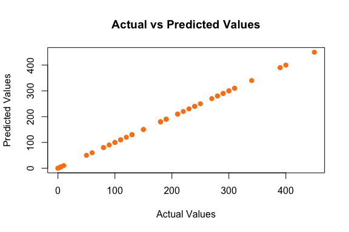

# Introduction

Here Eleonora you can write the introduction of the project describing the scope and the data used.

Thank you Albi, I will. What is our project scope though?

I think that we have to analyze the dataset and perform some statistical analysis on it. We can start by calculating the correlation matrix and then we can visualize the data through histograms, pairplots, barplots and boxplots. Finally, we can perform a regression analysis.


# Data

The dataset we will analyze in this project is *Starbucks Beverage Components* from Kaggle, that you can find at the following link: <https://www.kaggle.com/datasets/henryshan/starbucks>.

This data provides a comprehensive guide to the nutritional content of the beverages available on the Starbucks menu. We have a total of $242$ samples described by $18$ variables. These attributes include the name of the beverage, its categorization and preparation method, the total caloric content and the constituents of the beverage.

In the upcoming code lines, we import the dataset and generate a summary visualization. This initial step allows us to gain a better understanding of the data structure and the variables involved.


``` r
data <- read.csv("Data/starbucks.csv", header = TRUE, sep = ",")
```

## Data Transformation

Note that several variables in our dataset, namely "Vitamin.A....DV.", "Vitamin.C....DV.", "Calcium....DV." and "Iron....DV.", are represented as percentages. Consequently, the percentage symbol is included in our data. However, when conducting statistical analysis using R, the presence of non-numeric characters such as the percentage symbol can cause complications, interfering with the processing and analysis of the data. Therefore, we proceed to remove it.

Similarly, as R primarily operates on numeric and categorical data, we also convert all the other numerical variables into numeric format.

These preprocessing steps ensure a smooth and efficient analysis, making it easier to explore, visualize, and understand our data.


``` r
# Remove percentage sign from the data
data$Vitamin.C....DV. <- as.numeric(gsub("%", "", data$Vitamin.C....DV.))
data$Calcium....DV. <- as.numeric(gsub("%", "", data$Calcium....DV.))
data$Iron....DV. <- as.numeric(gsub("%", "", data$Iron....DV.))
data$Vitamin.A....DV. <- as.numeric(gsub("%", "", data$Vitamin.A....DV.))
# Set the other variables as numeric
data$Calories <- as.numeric(data$Calories)
data$Trans.Fat..g. <- as.numeric(data$Trans.Fat..g.)
data$Total.Fat..g. <- as.numeric(data$Total.Fat..g.)
data$Cholesterol..mg. <- as.numeric(data$Cholesterol..mg.)
data$Sodium..mg. <- as.numeric(data$Sodium..mg.)
data$Total.Carbohydrates..g. <- as.numeric(data$Total.Carbohydrates..g.)
data$Dietary.Fibre..g. <- as.numeric(data$Dietary.Fibre..g.)
data$Sugars..g. <- as.numeric(data$Sugars..g.)
data$Caffeine..mg. <- as.numeric(data$Caffeine..mg.)
```

## Data Cleaning

Another challenge we have to face is the presence of missing data. Indeed, in "Caffeine..mg." column there are some NA values. This is a common issue in data analysis and needs to be addressed appropriately to ensure the validity of our statistical results.

One way to deal with these unwanted NA values is to omit the samples containing them from our study. This guarantees that our analysis is conducted solely on complete and dependable data. 
Alternatively, we can fill them in with the average or the median of the observed values for that specific attribute. This second method helps to preserve the overall data distribution while addressing the missing data points.

In our work, we opt for the latter approach, replacing NA values with the median. This choice is particularly suitable for our data, which is skewed and contains outliers. Indeed, the median, being a measure of central tendency that is not affected by extreme values, provides a more robust replacement in the presence of outliers.


``` r
# Summary of the Caffeine column
summary(data$Caffeine..mg.)
```

```
##    Min. 1st Qu.  Median    Mean 3rd Qu.    Max.    NA's 
##    0.00   50.00   75.00   89.52  142.50  410.00      23
```

``` r
# Replace NA values with the median
data_cleaned <- data
data_cleaned$Caffeine..mg.[is.na(data_cleaned$Caffeine..mg.)] <- median(
  data_cleaned$Caffeine..mg., na.rm = TRUE)
# Summary of the Caffeine column after cleaning
summary(data_cleaned$Caffeine..mg.)
```

```
##    Min. 1st Qu.  Median    Mean 3rd Qu.    Max. 
##    0.00   70.00   75.00   88.14  130.00  410.00
```

## Rename Columns

Lastly, taking in consideration our cleaned data, we rename the columns by removing dots and units of measure, in order to obtain a more readable dataset.


``` r
colnames(data_cleaned) <- c("Beverage_category", "Beverage", "Beverage_prep",
                            "Calories", "Total_Fat", "Trans_Fat",
                            "Saturated_Fat", "Sodium", "Total_Carbohydrates",
                            "Cholesterol", "Dietary_Fibre", "Sugars",
                            "Protein", "Vitamin_A", "Vitamin_C",
                            "Calcium", "Iron", "Caffeine")
```

# Correlation Analysis

After completing these preliminary preprocessing steps, we calculate the correlation matrix for our dataset. This computation helps us in comprehending the interrelationships among the dataset’s variables. In the correlation matrix, a value near to $1$ at the $ij$ position indicates a strong positive correlation between the $i$-th and $j$-th variables. Conversely, a value close to $-1$ signifies a strong negative correlation. A value near $0$ suggests that the two variables do not significantly influence each other.

Observe that the first three columns of our data are categorical features, thus for these we cannot compute Pearson's correlation coefficient. In the following code lines we remove them to compute and plot such matrix.


``` r
# Remove first 3 columns for the correlation matrix since them are categorical
data_num <- data_cleaned[, -c(1:3)]
correlation_matrix <- cor(data_num)
# Plot the correlation matrix using corrplot
corrplot(correlation_matrix, method = "number", tl.col = "black", 
         tl.srt = 45, addCoef.col = "black", number.cex = 0.5, tl.cex = 0.7)
```


Moreover, we visualized the correlation matrix through a heatmap. The heatmap provides a visual representation of the correlation matrix, making it easier to identify patterns and relationships between the variables. The color gradient helps to distinguish between positive and negative correlations, with darker shades indicating stronger correlations.


``` r
# Heatmap of the correlation matrix
heatmap(cor(data_num), 
        col = colorRampPalette(c("#005cff", "#fbfbfb", "#d90000"))(100), 
        symm = TRUE, margins = c(8, 8), cexRow = 0.8, cexCol = 0.8)
```


**MAYBE WE CAN REMOVE THE HEATMAP AND KEEP ONLY THE CORRLOT SINCE IT STEAL A LOT OF SPACE FROM OUR REPORT**

# Data Visualization

## Histograms

We will plot some histograms to visualize the data.


``` r
# Histogram of the data with density distribution
par(mfrow = c(5, 3), mar = c(2, 2, 2, 2))
col <- c('#ff0000', '#f70028', '#ee0040', '#e50055', '#dc0069',
         '#d2007b', '#c7008d', '#bb009e', '#ae00ae', '#a000be',
         '#8f00cc', '#7d00da', '#6700e7', '#4900f3', '#0000ff')
for (i in 1:ncol(data_num)) {
  hist(data_num[, i], main = colnames(data_num)[i],
       xlab = colnames(data_num)[i], col = col[i], freq = FALSE)
  dens <- density(data_num[, i], na.rm=TRUE, adjust=1.25)
  lines(dens, col = "black", lwd = 2)
}
```


ADD COMMENTS ON THE GRAPH

## Pairplot

We will plot a pairplot to visualize the relationship between the variables. The pairplot is a grid of scatterplots that shows the relationship between each pair of variables in the dataset. This visualization helps us to identify patterns and correlations between the variables.

First of all we have to define the function for the pairplot. We will define a function for the histogram, the correlation and the smooth line.


Then we create the pairplot using the defined functions.


``` r
pairs(data_num, 
      diag.panel = panel.hist,
      upper.panel = panel.cor, 
      lower.panel = panel.smooth,
      colour = "#4ea5ff")
```


ADD COMMENTS ON THE GRAPH

## Barplot

We will plot a barplot of the data. The barplot is a graphical representation of the data that displays the frequency of each category in a categorical variable. This visualization helps us to understand the distribution of the data and identify the most common categories in the dataset.


``` r
par(mfrow = c(5, 3), mar = c(2, 2, 2, 2))
for (i in 1:ncol(data_num)) {
  barplot(table(data_num[, i]), main = colnames(data_num)[i],
          xlab = colnames(data_num)[i], col = col[i], border = col[i])
}
```


ADD COMMENTS ON THE GRAPH


### Beverages Barplot

We create a barplot to visualize the distribution of the 'Beverage_category' variable and the 'Beverage_prep' variable in order to understand the most common beverages and preparation methods.


``` r
par(mfrow = c(1, 1), mar = c(8, 2, 2, 2))
barplot(table(data$Beverage_category),
        main = "Distribution of Beverage Categories",
        ylab = "Count", col = "#4ea5ff", las = 2, cex.names = 0.6)
```


``` r
barplot(table(data$Beverage_prep),
        main = "Distribution of Beverage Preparation",
        ylab = "Count", col = "#ff810f", las = 2, cex.names = 0.6)
```


Now we want to compare the total calories for each categories of bevarage. First we aggrgate the data to obtain the total calories for each categories of bevarage and then we create a barplot to visualize the results.


``` r
par(mfrow = c(1, 1), mar = c(8, 4, 2, 2))
total_calories_by_category <- aggregate(Calories ~ Beverage_category,
                                        data = data_cleaned, sum)
barplot(height = total_calories_by_category$Calories,
        names.arg = total_calories_by_category$Beverage_category,
        main = "Total Calories by Beverage Category",
        ylab = "Total Calories", col = "#4ea5ff", las = 2, cex.names = 0.6)
```


Now we want to compare the total sugars for each preparation of bevarage. First we aggrgate the data to obtain the total sugars for each preparation of bevarage and then we create a barplot to visualize the results.


``` r
par(mfrow = c(1, 1), mar = c(8, 4, 2, 2))
total_sugar_by_prep <- aggregate(Total_Carbohydrates ~ Beverage_prep,
                                 data = data_cleaned, sum)
barplot(height = total_sugar_by_prep$Total_Carbohydrates,
        names.arg = total_sugar_by_prep$Beverage_prep,
        main = "Total Sugars by Beverage Preparation",
        ylab = "Total Sugars (g)", col = "#ff810f", las = 2, cex.names = 0.6)
```


## Boxplot

We will plot a boxplot of the data. The boxplot is a graphical representation of the data that displays the distribution of the data, including the median, quartiles, and outliers. This visualization helps us to identify the spread and variability of the data.


``` r
par(mfrow = c(3, 5), mar = c(2, 2, 2, 2))
for (i in 1:ncol(data_num)) {
  boxplot(data_num[, i], main = colnames(data_num)[i],
          xlab = colnames(data_num)[i], col = col[i])
}
```


## Scatterplot

We will plot a scatterplot of the data. The scatterplot is a graphical representation of the data that displays the relationship between two variables. This visualization helps us to identify patterns and correlations between the variables.

We create a scatterplot to compare the amounts of calories and fat for each categories of bevarage. We assign distinct colors to each beverage category and create a legend to identify each category.


``` r
# Set the variable as factor
data_cleaned$Beverage_category <- as.factor(data_cleaned$Beverage_category)
colors <- rainbow(length(unique(data_cleaned$Beverage_category)))
color_map <- setNames(colors, levels(data_cleaned$Beverage_category))
par(mfrow = c(1, 1))
plot(data_cleaned$Calories, 
     data_cleaned$Total_Fat_g,
     col = color_map[data_cleaned$Beverage_category],
     pch = 19, xlab = "Calories", ylab = "Total Fat (g)",
     main = "Calories vs Total Fat")
legend("topleft", legend = levels(data_cleaned$Beverage_category), 
       col = colors, cex = 0.4, pch = 19)
```


``` r
# Numeric variable -> calculate density
total_fat_density <- density(data_cleaned$Total_Fat)
trans_fat_density <- density(data_cleaned$Trans_Fat)
plot(total_fat_density, col = "#4ea5ff",
     main = "Comparison of Total Fat and Trans Fat Distributions", 
     xlab = "Fat Content (g)", ylab = "Density", 
     ylim = c(0, max(total_fat_density$y, trans_fat_density$y)),
     xlim = range(data_cleaned$Total_Fat, data_cleaned$Trans_Fat), 
     lwd = 2, lty = 1)
lines(trans_fat_density, col = "#ff810f", lwd = 2, lty = 1)
legend("topright", legend = c("Total Fat", "Trans Fat"),
       col = c("#4ea5ff", "#ff810f"), lwd = 2, lty = 1)
```


Create scatterplot to look into relantionship between calories and other variables. We will plot the relationship between calories and sodium, protein, vitamin C and fiber.


``` r
par(mfrow = c(2, 2), mar = c(4, 4, 2, 2))
with(data_cleaned, {
  plot(Calories, Sodium , main = "Relation between Calories and Sodium",
       xlab = "Calories", ylab = "Sodium (mg)", col = col[1])
  plot(Calories, Protein , main = "Relation between Calories and Protein",
       xlab = "Calories", ylab = "Protein (g)", col = col[5])
  plot(Calories, Vitamin_C , main = "Relation between Calories and Vitamin C",
       xlab = "Calories", ylab = "Vitamin C (mg)", col = col[10])
  plot(Calories, Cholesterol , main = "Relation between Calories and Fiber",
       xlab = "Calories", ylab = "Fiber (g)", col = col[15])
})
```


There's increase in every feature with increase in calories. Features like proteins and fiber rapidly increase, instead vitamin and cholesterol more flat growing. Confirmed by correlation coefficients 

ADD COMMENTS ON THE GRAPH

# Regression Analysis

## Linear Regression

Linear regression model to predict the amount of calories based on the amount of the other variables
We use the lm() function to fit a linear regression model


``` r
# Set the calories as the dependent variable
y <- data_num$Calories
# Remove calories column in order to use the other variables 
# as independent variables
data_num <- data_num[, -1]
# Linear regression model
lm_model <- lm(y ~ ., data = data_num)
summary(lm_model)
```

```
## 
## Call:
## lm(formula = y ~ ., data = data_num)
## 
## Residuals:
##      Min       1Q   Median       3Q      Max 
## -14.0233  -3.3009  -0.3806   3.0039  21.9404 
## 
## Coefficients:
##                      Estimate Std. Error t value Pr(>|t|)    
## (Intercept)          0.252316   0.952833   0.265  0.79140    
## Total_Fat           11.143733   0.532812  20.915  < 2e-16 ***
## Trans_Fat           -2.477820   0.809270  -3.062  0.00247 ** 
## Saturated_Fat       -9.816317  18.143619  -0.541  0.58901    
## Sodium              -0.279257   0.167487  -1.667  0.09683 .  
## Total_Carbohydrates  0.020972   0.007420   2.826  0.00513 ** 
## Cholesterol          2.829543   0.340268   8.316 8.43e-15 ***
## Dietary_Fibre        1.534913   0.942106   1.629  0.10465    
## Sugars               1.131045   0.348234   3.248  0.00134 ** 
## Protein              2.218895   0.510445   4.347 2.08e-05 ***
## Vitamin_A            0.162307   0.083662   1.940  0.05361 .  
## Vitamin_C            0.147669   0.047675   3.097  0.00220 ** 
## Calcium              0.462193   0.142257   3.249  0.00133 ** 
## Iron                -0.649101   0.070666  -9.185  < 2e-16 ***
## Caffeine             0.013513   0.005826   2.319  0.02126 *  
## ---
## Signif. codes:  0 '***' 0.001 '**' 0.01 '*' 0.05 '.' 0.1 ' ' 1
## 
## Residual standard error: 5.126 on 227 degrees of freedom
## Multiple R-squared:  0.9977,	Adjusted R-squared:  0.9975 
## F-statistic:  6915 on 14 and 227 DF,  p-value: < 2.2e-16
```

``` r
par(mfrow = c(2, 2), mar = c(2, 2, 2, 2))
plot(lm_model)
```


``` r
AIC(lm_model)
```

```
## [1] 1494.304
```

``` r
BIC(lm_model)
```

```
## [1] 1550.127
```
The model has a low AIC and BIC values, the R-squared value is 0.99 so the model is a good fit for the data. The model is significant, the p-value is less than 0.05

## Logistic Regression

Logistic regression model to predict the amount of calories based on the amount of the other variables
We use the glm() function to fit a logistic regression model

``` r
# Logistic regression model
glm_model <- glm(y ~ ., data = data_num, family = "gaussian") 
# Try to change the family
summary(glm_model)
```

```
## 
## Call:
## glm(formula = y ~ ., family = "gaussian", data = data_num)
## 
## Coefficients:
##                      Estimate Std. Error t value Pr(>|t|)    
## (Intercept)          0.252316   0.952833   0.265  0.79140    
## Total_Fat           11.143733   0.532812  20.915  < 2e-16 ***
## Trans_Fat           -2.477820   0.809270  -3.062  0.00247 ** 
## Saturated_Fat       -9.816317  18.143619  -0.541  0.58901    
## Sodium              -0.279257   0.167487  -1.667  0.09683 .  
## Total_Carbohydrates  0.020972   0.007420   2.826  0.00513 ** 
## Cholesterol          2.829543   0.340268   8.316 8.43e-15 ***
## Dietary_Fibre        1.534913   0.942106   1.629  0.10465    
## Sugars               1.131045   0.348234   3.248  0.00134 ** 
## Protein              2.218895   0.510445   4.347 2.08e-05 ***
## Vitamin_A            0.162307   0.083662   1.940  0.05361 .  
## Vitamin_C            0.147669   0.047675   3.097  0.00220 ** 
## Calcium              0.462193   0.142257   3.249  0.00133 ** 
## Iron                -0.649101   0.070666  -9.185  < 2e-16 ***
## Caffeine             0.013513   0.005826   2.319  0.02126 *  
## ---
## Signif. codes:  0 '***' 0.001 '**' 0.01 '*' 0.05 '.' 0.1 ' ' 1
## 
## (Dispersion parameter for gaussian family taken to be 26.27685)
## 
##     Null deviance: 2549987.0  on 241  degrees of freedom
## Residual deviance:    5964.8  on 227  degrees of freedom
## AIC: 1494.3
## 
## Number of Fisher Scoring iterations: 2
```

``` r
par(mfrow = c(2, 2), mar = c(2, 2, 2, 2))
plot(glm_model)
```



``` r
AIC(glm_model)
```

```
## [1] 1494.304
```

``` r
BIC(glm_model)
```

```
## [1] 1550.127
```

## Cross Validation

Cross validation is a technique used to evaluate the performance of a model. It involves splitting the data into training and testing sets, fitting the model using the training set, and evaluating the model using the testing set. This process is repeated multiple times to ensure that the model is robust and generalizes well to new data.

### Linear Regression

We split the data into training and testing sets, fit the linear regression model using the training set.


``` r
# Split the data into training and testing sets
set.seed(123)
train_index <- sample(1:nrow(data_num), 0.8 * nrow(data_num))
train_data <- data_num[train_index, ]
test_data <- data_num[-train_index, ]
# Fit the linear regression model using the training set
y_train <- y[train_index]
lm_model_train <- lm(y_train ~ ., data = train_data)
summary(lm_model_train)
```

```
## 
## Call:
## lm(formula = y_train ~ ., data = train_data)
## 
## Residuals:
##      Min       1Q   Median       3Q      Max 
## -13.3660  -3.4895  -0.3014   3.2957  22.0511 
## 
## Coefficients:
##                      Estimate Std. Error t value Pr(>|t|)    
## (Intercept)          0.384009   1.086638   0.353 0.724213    
## Total_Fat           11.010780   0.584930  18.824  < 2e-16 ***
## Trans_Fat           -2.384286   0.926402  -2.574 0.010876 *  
## Saturated_Fat       -6.394565  19.670475  -0.325 0.745499    
## Sodium              -0.344189   0.189423  -1.817 0.070894 .  
## Total_Carbohydrates  0.018919   0.008550   2.213 0.028182 *  
## Cholesterol          2.688521   0.393449   6.833 1.27e-10 ***
## Dietary_Fibre        1.334079   1.068310   1.249 0.213387    
## Sugars               1.270177   0.402629   3.155 0.001886 ** 
## Protein              2.288347   0.598184   3.825 0.000180 ***
## Vitamin_A            0.153517   0.104811   1.465 0.144767    
## Vitamin_C            0.192040   0.055413   3.466 0.000663 ***
## Calcium              0.458855   0.163646   2.804 0.005609 ** 
## Iron                -0.571726   0.080401  -7.111 2.70e-11 ***
## Caffeine             0.016253   0.006917   2.350 0.019895 *  
## ---
## Signif. codes:  0 '***' 0.001 '**' 0.01 '*' 0.05 '.' 0.1 ' ' 1
## 
## Residual standard error: 5.168 on 178 degrees of freedom
## Multiple R-squared:  0.9975,	Adjusted R-squared:  0.9973 
## F-statistic:  5061 on 14 and 178 DF,  p-value: < 2.2e-16
```

``` r
AIC(lm_model_train)
```

```
## [1] 1198.059
```

``` r
BIC(lm_model_train)
```

```
## [1] 1250.262
```

#### Model Evaluation

We evaluate the model using the testing set. We make predictions using the testing set and calculate the mean squared error and the root mean squared error to assess the model's accuracy. We also plot the residuals to check if the model is a good fit.


``` r
# Make predictions using the testing set
y_test <- y[-train_index]
predictions_lm <- predict(lm_model_train, newdata = test_data)
# Evaluate the model using the testing set
# Calculate the mean squared error
mse_lm<- mean((y_test - predictions_lm)^2)
mse_lm
```

```
## [1] 27.00986
```

``` r
# Calculate the root mean squared error
rmse_lm <- sqrt(mse_lm)
rmse_lm
```

```
## [1] 5.197101
```

``` r
# Plot the residuals to check if the model is a good fit
par(mfrow = c(1, 1))
plot(lm_model_train, which = 1)
```



The residuals are randomly distributed around zero, so the model is a good fit

Now we compute the accuracy of the model and then we plot the results


``` r
# Accuracy of the model
accuracy_lm <- 1 - (rmse_lm / mean(y_test))
accuracy_lm
```

```
## [1] 0.972211
```

``` r
plot(y_test, predictions_lm, main = "Actual vs Predicted Values",
     xlab = "Actual Values", ylab = "Predicted Values",
     col = "#4ea5ff", pch = 19)
```


The actual and predicted values are close to each other, so the model is a good fit

### Logistic Regression

We split the data into training and testing sets, fit the logistic regression model using the training set.


``` r
# Fit the logistic regression model using the training set
glm_model_train <- glm(y_train ~ ., data = train_data, family = "gaussian")
summary(glm_model_train)
```

```
## 
## Call:
## glm(formula = y_train ~ ., family = "gaussian", data = train_data)
## 
## Coefficients:
##                      Estimate Std. Error t value Pr(>|t|)    
## (Intercept)          0.384009   1.086638   0.353 0.724213    
## Total_Fat           11.010780   0.584930  18.824  < 2e-16 ***
## Trans_Fat           -2.384286   0.926402  -2.574 0.010876 *  
## Saturated_Fat       -6.394565  19.670475  -0.325 0.745499    
## Sodium              -0.344189   0.189423  -1.817 0.070894 .  
## Total_Carbohydrates  0.018919   0.008550   2.213 0.028182 *  
## Cholesterol          2.688521   0.393449   6.833 1.27e-10 ***
## Dietary_Fibre        1.334079   1.068310   1.249 0.213387    
## Sugars               1.270177   0.402629   3.155 0.001886 ** 
## Protein              2.288347   0.598184   3.825 0.000180 ***
## Vitamin_A            0.153517   0.104811   1.465 0.144767    
## Vitamin_C            0.192040   0.055413   3.466 0.000663 ***
## Calcium              0.458855   0.163646   2.804 0.005609 ** 
## Iron                -0.571726   0.080401  -7.111 2.70e-11 ***
## Caffeine             0.016253   0.006917   2.350 0.019895 *  
## ---
## Signif. codes:  0 '***' 0.001 '**' 0.01 '*' 0.05 '.' 0.1 ' ' 1
## 
## (Dispersion parameter for gaussian family taken to be 26.70325)
## 
##     Null deviance: 1896791.9  on 192  degrees of freedom
## Residual deviance:    4753.2  on 178  degrees of freedom
## AIC: 1198.1
## 
## Number of Fisher Scoring iterations: 2
```

``` r
AIC(glm_model_train)
```

```
## [1] 1198.059
```

``` r
BIC(glm_model_train)
```

```
## [1] 1250.262
```

#### Model Evaluation

We evaluate the model using the testing set. We make predictions using the testing set and calculate the mean squared error and the root mean squared error to assess the model's accuracy. We also plot the residuals to check if the model is a good fit.


``` r
# Make predictions using the testing set
predictions_glm <- predict(glm_model_train, newdata = test_data)
# Evaluate the model using the testing set
# Calculate the mean squared error
mse_glm <- mean((y_test - predictions_glm)^2)
mse_glm
```

```
## [1] 27.00986
```

``` r
# Calculate the root mean squared error
rmse_glm <- sqrt(mse_glm)
rmse_glm
```

```
## [1] 5.197101
```

``` r
# Plot the residuals to check if the model is a good fit
par(mfrow = c(1, 1))
plot(glm_model_train, which = 1)
```



The residuals are randomly distributed around zero, so the model is a good fit

Now we compute the accuracy of the model and then we plot the results


``` r
# Accuracy of the model
accuracy_glm <- 1 - (rmse_glm / mean(y_test))
accuracy_glm
```

```
## [1] 0.972211
```

``` r
plot(y_test, predictions_glm, main = "Actual vs Predicted Values",
     xlab = "Actual Values", ylab = "Predicted Values",
     col = "#ff810f", pch = 19)
```



The actual and predicted values are close to each other, so the model is a good fit

