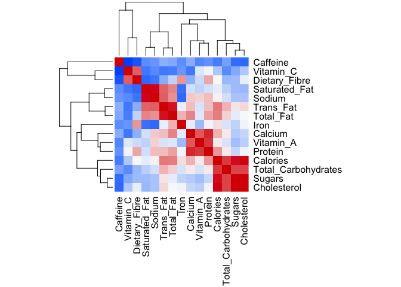
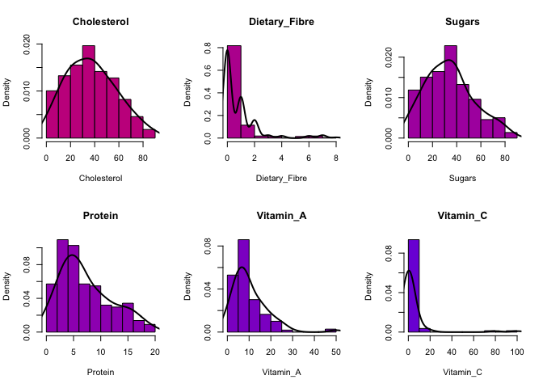
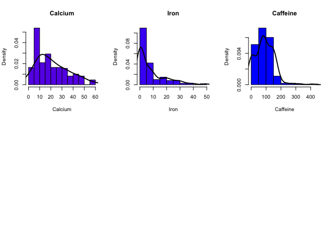
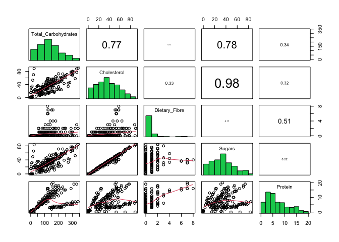
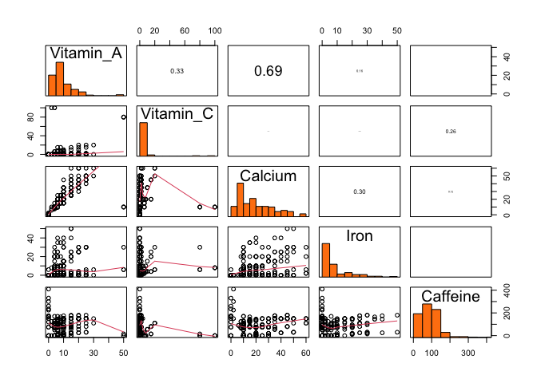
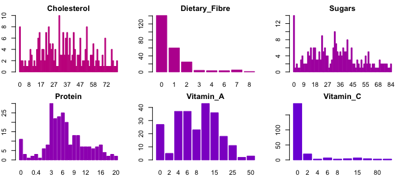
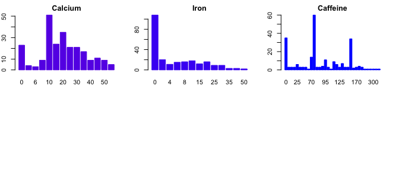
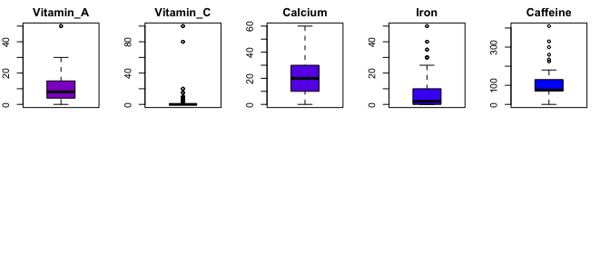
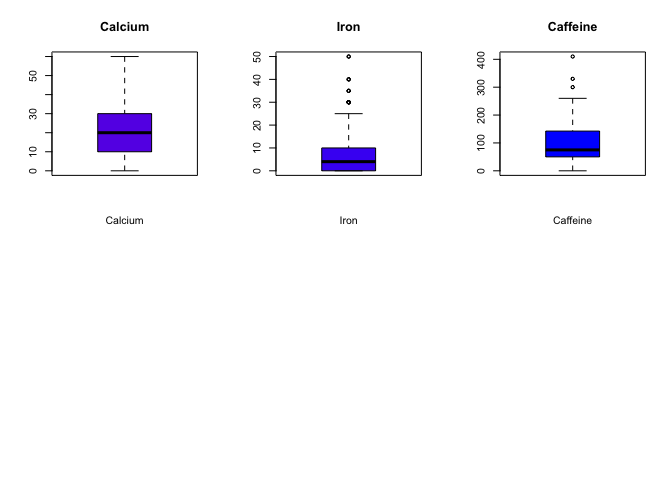

# Introduction

Here Eleonora you can write the introduction of the project describing the scope and the data used.

Thank you Albi, I will. What is our project scope though?

# Libraries


``` r
library(corrplot)
library(knitr)
```

# Data

The dataset we will analyze in this project is *Starbucks Beverage Components* from Kaggle, that you can find at the following link: <https://www.kaggle.com/datasets/henryshan/starbucks>.

This data provides a comprehensive guide to the nutritional content of the beverages available on the Starbucks menu. We have a total of $242$ samples described by $18$ variables. These attributes include the name of the beverage, its categorization and preparation method, the total caloric content and the constituents of the beverage.

In the upcoming code lines, we import the dataset and generate a summary visualization.


``` r
data <- read.csv("Data/starbucks.csv", header = TRUE, sep = ",")

# Overview of the data
summary(data)
```

```
##  Beverage_category    Beverage         Beverage_prep         Calories    
##  Length:242         Length:242         Length:242         Min.   :  0.0  
##  Class :character   Class :character   Class :character   1st Qu.:120.0  
##  Mode  :character   Mode  :character   Mode  :character   Median :185.0  
##                                                           Mean   :193.9  
##                                                           3rd Qu.:260.0  
##                                                           Max.   :510.0  
##  Total.Fat..g.    Trans.Fat..g.   Saturated.Fat..g.  Sodium..mg.    
##  Min.   : 0.000   Min.   :0.000   Min.   :0.0000    Min.   : 0.000  
##  1st Qu.: 0.200   1st Qu.:0.100   1st Qu.:0.0000    1st Qu.: 0.000  
##  Median : 2.500   Median :0.500   Median :0.0000    Median : 5.000  
##  Mean   : 2.905   Mean   :1.307   Mean   :0.0376    Mean   : 6.364  
##  3rd Qu.: 4.500   3rd Qu.:2.000   3rd Qu.:0.1000    3rd Qu.:10.000  
##  Max.   :15.000   Max.   :9.000   Max.   :0.3000    Max.   :40.000  
##  Total.Carbohydrates..g. Cholesterol..mg. Dietary.Fibre..g.   Sugars..g.   
##  Min.   :  0.0           Min.   : 0.00    Min.   :0.0000    Min.   : 0.00  
##  1st Qu.: 70.0           1st Qu.:21.00    1st Qu.:0.0000    1st Qu.:18.00  
##  Median :125.0           Median :34.00    Median :0.0000    Median :32.00  
##  Mean   :128.9           Mean   :35.99    Mean   :0.8058    Mean   :32.96  
##  3rd Qu.:170.0           3rd Qu.:50.75    3rd Qu.:1.0000    3rd Qu.:43.75  
##  Max.   :340.0           Max.   :90.00    Max.   :8.0000    Max.   :84.00  
##   Protein..g.     Vitamin.A....DV.   Vitamin.C....DV.   Calcium....DV.    
##  Min.   : 0.000   Length:242         Length:242         Length:242        
##  1st Qu.: 3.000   Class :character   Class :character   Class :character  
##  Median : 6.000   Mode  :character   Mode  :character   Mode  :character  
##  Mean   : 6.979                                                           
##  3rd Qu.:10.000                                                           
##  Max.   :20.000                                                           
##  Iron....DV.        Caffeine..mg.     
##  Length:242         Length:242        
##  Class :character   Class :character  
##  Mode  :character   Mode  :character  
##                                       
##                                       
## 
```

``` r
str(data)
```

```
## 'data.frame':	242 obs. of  18 variables:
##  $ Beverage_category      : chr  "Coffee" "Coffee" "Coffee" "Coffee" ...
##  $ Beverage               : chr  "Brewed Coffee" "Brewed Coffee" "Brewed Coffee" "Brewed Coffee" ...
##  $ Beverage_prep          : chr  "Short" "Tall" "Grande" "Venti" ...
##  $ Calories               : int  3 4 5 5 70 100 70 100 150 110 ...
##  $ Total.Fat..g.          : num  0.1 0.1 0.1 0.1 0.1 3.5 2.5 0.2 6 4.5 ...
##  $ Trans.Fat..g.          : num  0 0 0 0 0.1 2 0.4 0.2 3 0.5 ...
##  $ Saturated.Fat..g.      : num  0 0 0 0 0 0.1 0 0 0.2 0 ...
##  $ Sodium..mg.            : int  0 0 0 0 5 15 0 5 25 0 ...
##  $ Total.Carbohydrates..g.: int  5 10 10 10 75 85 65 120 135 105 ...
##  $ Cholesterol..mg.       : int  0 0 0 0 10 10 6 15 15 10 ...
##  $ Dietary.Fibre..g.      : int  0 0 0 0 0 0 1 0 0 1 ...
##  $ Sugars..g.             : int  0 0 0 0 9 9 4 14 14 6 ...
##  $ Protein..g.            : num  0.3 0.5 1 1 6 6 5 10 10 8 ...
##  $ Vitamin.A....DV.       : chr  "0%" "0%" "0%" "0%" ...
##  $ Vitamin.C....DV.       : chr  "0%" "0%" "0%" "0%" ...
##  $ Calcium....DV.         : chr  "0%" "0%" "0%" "2%" ...
##  $ Iron....DV.            : chr  "0%" "0%" "0%" "0%" ...
##  $ Caffeine..mg.          : chr  "175" "260" "330" "410" ...
```

## Data Transformation

Note that several variables in our dataset, namely "Vitamin.A....DV.", "Vitamin.C....DV.", "Calcium....DV." and "Iron....DV.", are represented as percentages. Consequently, the percentage symbol is included in our data. However, when conducting statistical analysis using R, the presence of non-numeric characters such as the percentage symbol can cause complications, interfering with the processing and analysis of the data. Therefore, we proceeded to remove it.

Similarly, as R primarily operates on numeric and categorical data, we also convert all the other numerical variables into numeric format.

These preprocessing steps ensure a smooth and efficient analysis, making it easier to explore, visualize, and understand our data.


``` r
# Remove percentage sign from the data
data$Vitamin.C....DV. <- as.numeric(gsub("%", "", data$Vitamin.C....DV.))
data$Calcium....DV. <- as.numeric(gsub("%", "", data$Calcium....DV.))
data$Iron....DV. <- as.numeric(gsub("%", "", data$Iron....DV.))
data$Vitamin.A....DV. <- as.numeric(gsub("%", "", data$Vitamin.A....DV.))

# Set the other variables as numeric
data$Calories <- as.numeric(data$Calories)
data$Trans.Fat..g. <- as.numeric(data$Trans.Fat..g.)
data$Total.Fat..g. <- as.numeric(data$Total.Fat..g.)
data$Cholesterol..mg. <- as.numeric(data$Cholesterol..mg.)
data$Sodium..mg. <- as.numeric(data$Sodium..mg.)
data$Total.Carbohydrates..g. <- as.numeric(data$Total.Carbohydrates..g.)
data$Dietary.Fibre..g. <- as.numeric(data$Dietary.Fibre..g.)
data$Sugars..g. <- as.numeric(data$Sugars..g.)
data$Caffeine..mg. <- as.numeric(data$Caffeine..mg.)
```

## Data Cleaning

Another challenge we have to face is the presence of missing data. Indeed, in "Caffeine..mg." column there are some NA values. This is a common issue in data analysis and needs to be addressed appropriately to ensure the validity of our statistical results.

There are different approaches to deal with this issue. We did - COMPLETE.

One way to handle this issue is removing the observations with NA values.

A different approach is to fill in the NA values with the average of the observed values for that specific attribute. This method helps to preserve the overall data distribution while addressing the missing data points.


``` r
data_cleaned <- data[!is.na(data$Caffeine..mg.),]
```

## Rename Columns

Lastly, taking in consideration our cleaned data, we rename the columns by removing dots and units of measure, in order to obtain a more readable dataset.


``` r
colnames(data_cleaned) <- c("Beverage_category", "Beverage",
                            "Beverage_prep", "Calories",
                            "Total_Fat", "Trans_Fat",
                            "Saturated_Fat", "Sodium",
                            "Total_Carbohydrates", "Cholesterol",
                            "Dietary_Fibre", "Sugars",
                            "Protein", "Vitamin_A",
                            "Vitamin_C", "Calcium",
                            "Iron", "Caffeine")
```

# Correlation Analysis

After completing these preliminary preprocessing steps, we calculate the correlation matrix for our dataset. This computation helps us in comprehending the interrelationships among the dataset’s variables. In the correlation matrix, a value near to $1$ at the $ij$ position indicates a strong positive correlation between the $i$-th and $j$-th variables. Conversely, a value close to $-1$ signifies a strong negative correlation. A value near $0$ suggests that the two variables do not significantly influence each other.

Observe that the first three columns of our data are categorical features, therefore for these we cannot compute Pearson's correlation coefficient. In the following code lines we remove them to compute and plot such matrix.


``` r
# Remove first 3 columns for the correlation matrix since them are categorical
data_num <- data_cleaned[, -c(1:3)]

# Calculate the correlation matrix

correlation_matrix <- cor(data_num)

# Plot the correlation matrix using corrplot
corrplot(correlation_matrix, method = "number", tl.col = "black", 
         tl.srt = 45, addCoef.col = "black", number.cex = 0.5)
```


``` r
# Heatmap of the correlation matrix
heatmap(cor(data_num), 
        col = colorRampPalette(c("#005cff", "#fbfbfb", "#d90000"))(100), 
        symm = TRUE, 
        margins = c(10, 10), 
        cexRow = 1.2,
        cexCol = 1.2)
```



Thanks to the use of a heatmap : Add some comments on the graph that we obtained.

# Data Visualization

## Histograms

We will plot some histograms to visualize the data.


``` r
# Histogram of the data with density distribution
par(mfrow = c(2, 3))
col <- c('#ff0000', '#f70028', '#ee0040', '#e50055', '#dc0069',
         '#d2007b', '#c7008d', '#bb009e', '#ae00ae', '#a000be',
         '#8f00cc', '#7d00da', '#6700e7', '#4900f3', '#0000ff')
for (i in 1:ncol(data_num)) {
  hist(data_num[, i], main = colnames(data_num)[i],
       xlab = colnames(data_num)[i], col = col[i], freq = FALSE)
  dens <- density(data_num[, i], na.rm=TRUE, adjust=1.25)
  lines(dens, col = "black", lwd = 2)
}
```



## Pairplot

We will plot a pairplot to visualize the relationship between the variables.

First of all we have to define the function for the pairplot.


``` r
# Histogram function
panel.hist <- function(x, colour, ...)
{
  usr <- par("usr")
  on.exit(par(usr))
  par(usr = c(usr[1:2], 0, 1.5))
  h <- hist(x, plot = FALSE)
  breaks <- h$breaks
  nB <- length(breaks)
  y <- h$counts
  y <- y / max(y)
  rect(breaks[-nB], 0, breaks[-1], y, col = colour, ...)
}

# Correlations function
panel.cor <- function(x, y, digits = 2, prefix = "", cex.cor, ...)
{
  usr <- par("usr")
  on.exit(par(usr))
  par(usr = c(0, 1, 0, 1))
  r <- abs(cor(x, y))
  txt <- format(c(r, 0.123456789), digits = digits)[1]
  txt <- paste0(prefix, txt)
  if(missing(cex.cor)) cex.cor <- 0.5/strwidth(txt)
  text(0.5, 0.5, txt, cex = cex.cor * r)
}
```

Now we can split the data into 3 groups in order to have a better visualization.


``` r
data_num1 <- data_num[, 1:5]
data_num2 <- data_num[, 6:10]
data_num3 <- data_num[, 11:15]

pairs(data_num1, 
      diag.panel = panel.hist,
      upper.panel = panel.cor, 
      lower.panel = panel.smooth,
      colour = "#4ea5ff")
```


``` r
pairs(data_num2, 
      diag.panel = panel.hist,
      upper.panel = panel.cor,
      lower.panel = panel.smooth,
      colour = "#00cd5c")
```



``` r
pairs(data_num3, 
      diag.panel = panel.hist,
      upper.panel = panel.cor,
      lower.panel = panel.smooth,
      colour = "#ff810f")
```



ADD COMMENTS ON THE GRAPH

## Barplot

We will plot a barplot of the data.


``` r
# Barplot of the data
par(mfrow = c(2, 3))
for (i in 1:ncol(data_num)) {
  barplot(table(data_num[, i]), main = colnames(data_num)[i],
          xlab = colnames(data_num)[i], col = col[i], border = col[i])
}
```



ADD COMMENTS ON THE GRAPH

## Boxplot

We will plot a boxplot of the data.


``` r
# Boxplot of the data
par(mfrow = c(2, 3))
for (i in 1:ncol(data_num)) {
  boxplot(data_num[, i], main = colnames(data_num)[i],
          xlab = colnames(data_num)[i], col = col[i])
}
```



ADD COMMENTS ON THE GRAPH

# Regression Analysis

## Linear Regression

## Logistic Regression
