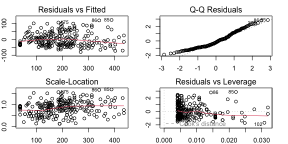
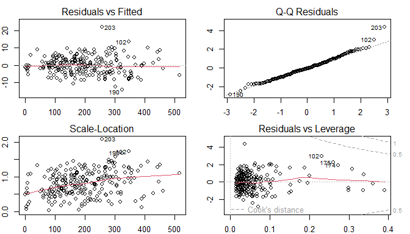
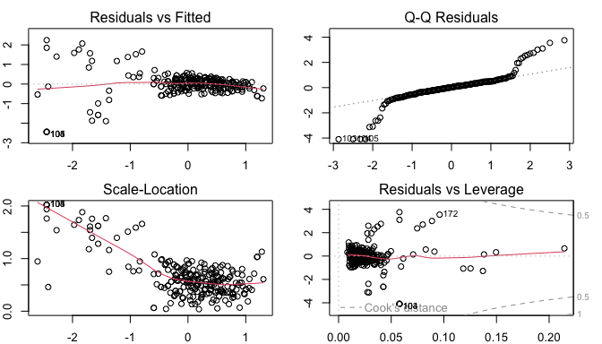

# Introduction

Here Eleonora you can write the introduction of the project describing the scope and the data used.

Thank you Albi, I will. What is our project scope though?

I think that we have to analyze the dataset and perform some statistical analysis on it. 
We can start by calculating the correlation matrix and then we can visualize the data through histograms, pairplots, barplots and boxplots. 
Finally, we can perform a regression analysis.


# Data

The dataset we will analyze in this project is *Starbucks Beverage Components* from Kaggle, that you can find at the following link: <https://www.kaggle.com/datasets/henryshan/starbucks>.

This data provides a comprehensive guide to the nutritional content of the beverages available on the Starbucks menu. 
We have a total of $242$ samples described by $18$ variables. 
These attributes include the name of the beverage, its categorization and preparation method, the total caloric content and the constituents of the beverage.

In the upcoming code lines, we import the dataset and generate a summary visualization. 
This initial step allows us to gain a better understanding of the data structure and the variables involved.


``` r
data <- read.csv("Data/starbucks.csv", header = TRUE, sep = ",")
```

## Data Transformation

Note that several variables in our dataset, namely "Vitamin.A....DV.", "Vitamin.C....DV.", "Calcium....DV." and "Iron....DV.", are represented as percentages.
Consequently, the percentage symbol is included in our data. However, when conducting statistical analysis using R, the presence of non-numeric characters such as the percentage symbol can cause complications, interfering with the processing and analysis of the data. 
Therefore, we proceed to remove it.

Similarly, as R primarily operates on numeric and categorical data, we also convert all the other numerical variables into numeric format.

These preprocessing steps ensure a smooth and efficient analysis, making it easier to explore, visualize, and understand our data.


``` r
# Remove percentage sign from the data
data$Vitamin.C....DV. <- as.numeric(gsub("%", "", data$Vitamin.C....DV.))
data$Calcium....DV. <- as.numeric(gsub("%", "", data$Calcium....DV.))
data$Iron....DV. <- as.numeric(gsub("%", "", data$Iron....DV.))
data$Vitamin.A....DV. <- as.numeric(gsub("%", "", data$Vitamin.A....DV.))
# Set the other variables as numeric
data$Calories <- as.numeric(data$Calories)
data$Trans.Fat..g. <- as.numeric(data$Trans.Fat..g.)
data$Total.Fat..g. <- as.numeric(data$Total.Fat..g.)
data$Cholesterol..mg. <- as.numeric(data$Cholesterol..mg.)
data$Sodium..mg. <- as.numeric(data$Sodium..mg.)
data$Total.Carbohydrates..g. <- as.numeric(data$Total.Carbohydrates..g.)
data$Dietary.Fibre..g. <- as.numeric(data$Dietary.Fibre..g.)
data$Sugars..g. <- as.numeric(data$Sugars..g.)
data$Caffeine..mg. <- as.numeric(data$Caffeine..mg.)
```

## Data Cleaning

Another challenge we have to face is the presence of missing data. Indeed, in "Caffeine..mg." column there are some NA values. 
This is a common issue in data analysis and needs to be addressed appropriately to ensure the validity of our statistical results.

One way to deal with these unwanted NA values is to omit the samples containing them from our study. 
This guarantees that our analysis is conducted solely on complete and dependable data. 
Alternatively, we can fill them in with the average or the median of the observed values for that specific attribute. 
This second method helps to preserve the overall data distribution while addressing the missing data points.

In our work, we opt for the latter approach, replacing NA values with the median. 
This choice is particularly suitable for our data, which is skewed and contains outliers. 
Indeed, the median, being a measure of central tendency that is not affected by extreme values, provides a more robust replacement in the presence of outliers.


``` r
# Summary of the Caffeine column
summary(data$Caffeine..mg.)
```

```
##    Min. 1st Qu.  Median    Mean 3rd Qu.    Max.    NA's 
##    0.00   50.00   75.00   89.52  142.50  410.00      23
```

``` r
# Replace NA values with the median
data_cleaned <- data
data_cleaned$Caffeine..mg.[is.na(data_cleaned$Caffeine..mg.)] <- median(
  data_cleaned$Caffeine..mg., na.rm = TRUE)
# Summary of the Caffeine column after cleaning
summary(data_cleaned$Caffeine..mg.)
```

```
##    Min. 1st Qu.  Median    Mean 3rd Qu.    Max. 
##    0.00   70.00   75.00   88.14  130.00  410.00
```

## Rename Columns

Lastly, taking in consideration our cleaned data, we rename the columns by removing dots and units of measure, in order to obtain a more readable dataset.


``` r
colnames(data_cleaned) <- c("Beverage_category", "Beverage", "Beverage_prep",
                            "Calories", "Total_Fat", "Trans_Fat",
                            "Saturated_Fat", "Sodium", "Total_Carbohydrates",
                            "Cholesterol", "Dietary_Fibre", "Sugars",
                            "Protein", "Vitamin_A", "Vitamin_C",
                            "Calcium", "Iron", "Caffeine")
```

# Correlation Analysis

After completing these preliminary preprocessing steps, we calculate the correlation matrix for our dataset. 
This computation helps us in comprehending the interrelationships among the dataset’s variables. 
In the correlation matrix, a value near to $1$ at the $ij$ position indicates a strong positive correlation between the $i$-th and $j$-th variables. 
Conversely, a value close to $-1$ signifies a strong negative correlation. 
A value near $0$ suggests that the two variables do not significantly influence each other.

Observe that the first three columns of our data are categorical features, thus for these we cannot compute Pearson's correlation coefficient. 
In the following code lines we remove them to compute and plot such matrix.


``` r
# Remove first 3 columns for the correlation matrix since them are categorical
data_num <- data_cleaned[, sapply(data_cleaned, is.numeric)]
correlation_matrix <- cor(data_num)
# Plot the correlation matrix using corrplot
corrplot(correlation_matrix, method = "number", tl.col = "black", 
         tl.srt = 45, addCoef.col = "black", number.cex = 0.5, tl.cex = 0.7)
```


# Data Visualization

Data visualization is a powerful tool that allows us to uncover patterns, correlations and outliers in our data.
It provides visual information on the dataset in our analysis, representing large amounts of data in a clear and comprehensive way and underlining the relationships among them.
This enables us to recognize patterns quickly.

So, let us transform our raw data into graphical representations, to gain a more comprehensive understanding of the information at hand.

## Histograms

Histograms serve as a graphical interpretation of data distribution.
In a histogram, each bar corresponds to the counted frequency within each bin or interval.
We introduce these plots to see if our data is normally distributed, skewed, or has outlier values.


``` r
# Histogram of the data with density distribution
par(mfrow = c(5, 3), mar = c(2, 2, 2, 2))
col <- c('#ff0000', '#f70028', '#ee0040', '#e50055', '#dc0069',
         '#d2007b', '#c7008d', '#bb009e', '#ae00ae', '#a000be',
         '#8f00cc', '#7d00da', '#6700e7', '#4900f3', '#0000ff')
for (i in 1:ncol(data_num)) {
  hist(data_num[, i], main = colnames(data_num)[i],
       xlab = colnames(data_num)[i], col = col[i], freq = FALSE)
  dens <- density(data_num[, i], na.rm=TRUE, adjust=1.25)
  lines(dens, col = "black", lwd = 2)
}
```


By looking at the graphs, we can notice that the variables "Calories", "Total_Carbohydrates", "Cholesterol", and "Sugars" exhibit distributions that are nearly normal.
Conversely, the distributions of the remaining variables display a noticeable skewness towards the left.

## Pairplot

**io questi li toglierei. tanto spazio**

We will plot a pairplot to visualize the relationship between the variables. 
The pairplot is a grid of scatterplots that shows the relationship between each pair of variables in the dataset. 
This visualization helps us to identify patterns and correlations between the variables.

First of all we have to define the function for the pairplot.
We will define a function for the histogram, the correlation and the smooth line.


Then we create the pairplot using the defined functions.


``` r
pairs(data_num, 
      diag.panel = panel.hist,
      upper.panel = panel.cor, 
      lower.panel = panel.smooth,
      colour = "#4ea5ff")
```


ADD COMMENTS ON THE GRAPH

## Barplot

We will now plot the bar plots for our dataset.
The primary use of bar plots is to make comparisons between the amounts of different categories.
Indeed, each bar corresponds to a category and the height of the bar represents the frequency or proportion of that category.
These graphs are commonly used for categorical data, or numerical data that has been binned into categories.


``` r
par(mfrow = c(5, 3), mar = c(2, 2, 2, 2))
for (i in 1:ncol(data_num)) {
  barplot(table(data_num[, i]), main = colnames(data_num)[i],
          xlab = colnames(data_num)[i], col = col[i], border = col[i])
}
```


We can deduce some useful information by looking at these plots.

For example, we can notice that variables such as "Saturated_Fat", "Dietary_Fibre", "Vitamin_C", and "Iron" are typically either absent or present in small quantities in the beverages.
In particular, the frequency of these variables rapidly diminishes as their levels increase.
On the other hand, the variables "Calories", "Total_Fat", "Trans_Fat", and "Total_Carbohydrates" show a wide range of values across different beverage types, going from high levels in some beverages to minimal amounts in others.

We can further observe that the distribution of "Vitamin_A" appears to be more evenly spread among the different levels in various beverages, while instead "Caffeine" plot is interesting as it exhibits three distinct peaks in frequency.

### Beverages Barplot

As previously anticipated, bar plots also allows us to see the distribution of categorical variables like "Beverage_category" and "Beverage_prep".
In this way we can identify the most frequently occurring beverages and their preparation methods.


``` r
par(mfrow = c(1, 1), mar = c(8, 2, 2, 2))
barplot(table(data$Beverage_category),
        main = "Distribution of Beverage Categories",
        ylab = "Count", col = "#4ea5ff", las = 2, cex.names = 0.6)
```


``` r
barplot(table(data$Beverage_prep),
        main = "Distribution of Beverage Preparation",
        ylab = "Count", col = "#ff810f", las = 2, cex.names = 0.6)
```


At this point, we aim to compare the total calorie content among different beverage categories.
To do so, we first aggregate the data to obtain the total calories for each beverage category.
Secondly, we construct a bar plot to visually represent the results.


``` r
par(mfrow = c(1, 1), mar = c(8, 4, 2, 2))
total_calories_by_category <- aggregate(Calories ~ Beverage_category,
                                        data = data_cleaned, sum)
barplot(height = total_calories_by_category$Calories,
        names.arg = total_calories_by_category$Beverage_category,
        main = "Total Calories by Beverage Category",
        ylab = "Total Calories", col = "#4ea5ff", las = 2, cex.names = 0.6)
```


Similarly, we compare the total sugars for each beverage preparation, gathering data to obtain the total sugars for each preparation of beverage and successively creating a bar plot.


``` r
par(mfrow = c(1, 1), mar = c(8, 4, 2, 2))
total_sugar_by_prep <- aggregate(Total_Carbohydrates ~ Beverage_prep,
                                 data = data_cleaned, sum)
barplot(height = total_sugar_by_prep$Total_Carbohydrates,
        names.arg = total_sugar_by_prep$Beverage_prep,
        main = "Total Sugars by Beverage Preparation",
        ylab = "Total Sugars (g)", col = "#ff810f", las = 2, cex.names = 0.6)
```


## Boxplot

We will plot a boxplot of the data. 
The boxplot is a graphical representation of the data that displays the distribution of the data, including the median, quartiles, and outliers. 
This visualization helps us to identify the spread and variability of the data.


``` r
par(mfrow = c(3, 5), mar = c(2, 2, 2, 2))
for (i in 1:ncol(data_num)) {
  boxplot(data_num[, i], main = colnames(data_num)[i],
          xlab = colnames(data_num)[i], col = col[i])
}
```


## Scatterplot

We will plot a scatterplot of the data. 
The scatterplot is a graphical representation of the data that displays the relationship between two variables. 
This visualization helps us to identify patterns and correlations between the variables.

We create a scatterplot to compare the amounts of calories and fat for each categories of bevarage. 
We assign distinct colors to each beverage category and create a legend to identify each category.


``` r
# Set the variable as factor
data_cleaned$Beverage_category <- as.factor(data_cleaned$Beverage_category)
colors <- rainbow(length(unique(data_cleaned$Beverage_category)))
color_map <- setNames(colors, levels(data_cleaned$Beverage_category))
par(mfrow = c(1, 1))
plot(data_cleaned$Calories, 
     data_cleaned$Total_Fat_g,
     col = color_map[data_cleaned$Beverage_category],
     pch = 19, xlab = "Calories", ylab = "Total Fat (g)",
     main = "Calories vs Total Fat")
legend("topleft", legend = levels(data_cleaned$Beverage_category), 
       col = colors, cex = 0.4, pch = 19)
```


``` r
# Numeric variable -> calculate density
total_fat_density <- density(data_cleaned$Total_Fat)
trans_fat_density <- density(data_cleaned$Trans_Fat)
plot(total_fat_density, col = "#4ea5ff",
     main = "Comparison of Total Fat and Trans Fat Distributions", 
     xlab = "Fat Content (g)", ylab = "Density", 
     ylim = c(0, max(total_fat_density$y, trans_fat_density$y)),
     xlim = range(data_cleaned$Total_Fat, data_cleaned$Trans_Fat), 
     lwd = 2, lty = 1)
lines(trans_fat_density, col = "#ff810f", lwd = 2, lty = 1)
legend("topright", legend = c("Total Fat", "Trans Fat"),
       col = c("#4ea5ff", "#ff810f"), lwd = 2, lty = 1)
```


Create scatterplot to look into relantionship between calories and other variables. 
We will plot the relationship between calories and sodium, protein, vitamin C and fiber.


``` r
par(mfrow = c(2, 2), mar = c(4, 4, 2, 2))
with(data_cleaned, {
  plot(Calories, Sodium , main = "Relation between Calories and Sodium",
       xlab = "Calories", ylab = "Sodium (mg)", col = col[1])
  plot(Calories, Protein , main = "Relation between Calories and Protein",
       xlab = "Calories", ylab = "Protein (g)", col = col[5])
  plot(Calories, Vitamin_C , main = "Relation between Calories and Vitamin C",
       xlab = "Calories", ylab = "Vitamin C (mg)", col = col[10])
  plot(Calories, Cholesterol , main = "Relation between Calories and Fiber",
       xlab = "Calories", ylab = "Fiber (g)", col = col[15])
})
```


There's increase in every feature with increase in calories.
Features like proteins and fiber rapidly increase, instead vitamin and cholesterol more flat growing. 
Confirmed by correlation coefficients 

ADD COMMENTS ON THE GRAPH

# Regression Analysis

## Linear Regression

Linear regression model to predict the amount of calories based on the amount of the other variables
We use the lm() function to fit a linear regression model

### Simple Linear Regression
Fit linear simple regression with just one variable on data_cleaned, looking at correlation plot we choose Sugars due to high correlation.


This code will fit a simple linear regression model predicting "Calories" using "Sugars" as the predictor variable and provide a summary of the model.


``` r
lm_simple <- lm(Calories ~ Sugars, data = data_cleaned)
kable(data.frame(AIC = AIC(lm_simple), BIC = BIC(lm_simple),
                 R_squared = summary(lm_simple)$r.squared, 
                 adj_R_squared = summary(lm_simple)$adj.r.squared), 
      caption = "Model evaluation metrics for the simple linear regression model")
```


Table: Model evaluation metrics for the simple linear regression model

|      AIC|      BIC| R_squared| adj_R_squared|
|--------:|--------:|---------:|-------------:|
| 2509.036| 2519.503| 0.8275094|     0.8267907|

``` r
par(mfrow = c(2, 2), mar = c(2, 2, 2, 2))
plot(lm_simple)
```


The coefficient for "Sugars" ($4.7426$) indicates that, on average, for every one-unit increase in "Sugars", the predicted "Calories" increases by approximately $4.7426$ units.
Both the intercept and the coefficient for "Sugars" are statistically significant ($p < 0.001$), indicating a strong linear relationship between "Sugars" and "Calories".
The F-statistic is highly significant ($p < 2.2e-16$), indicating that the overall regression model is statistically significant in explaining the variance in "Calories".
Model Fit:The adjusted R-squared value ($0.8268$) indicates that approximately $82.68%$ of the variance in "Calories" can be explained by the predictor variable "Sugars".
Overall, this output suggests that the simple linear regression model provides a statistically significant relationship between "Sugars" and "Calories", with "Sugars" being a strong predictor of "Calories".
However, the AIC and BIC values suggest that there might be other models that provide a better fit for the data.
Summarizing the model is too simple so it doesn't capture the complexity of the data, so we try to fit a multiple linear regression model.

### Multiple Linear Regression

``` r
lm_model <- lm(y ~ ., data = data_num_)
par(mfrow = c(2, 2), mar = c(2, 2, 2, 2))
plot(lm_model)
```


``` r
kable(data.frame(AIC = AIC(lm_model), BIC = BIC(lm_model),
                 R_squared = summary(lm_model)$r.squared, 
                 adj_R_squared = summary(lm_model)$adj.r.squared),
      caption = "Model evaluation metrics for the linear regression model")
```


Table: Model evaluation metrics for the linear regression model

|      AIC|      BIC| R_squared| adj_R_squared|
|--------:|--------:|---------:|-------------:|
| 1494.304| 1550.127| 0.9976608|     0.9975166|
The model has a low AIC and BIC values, the R-squared value is $0.997$ so the model is a good fit for the data.

### Backward Elimination
Now we apply the selection of the predictors with the backward elimination method.

```
## Start:  AIC=805.54
## y ~ Total_Fat + Trans_Fat + Saturated_Fat + Sodium + Total_Carbohydrates + 
##     Cholesterol + Dietary_Fibre + Sugars + Protein + Vitamin_A + 
##     Vitamin_C + Calcium + Iron + Caffeine
## 
##                       Df Sum of Sq     RSS     AIC
## - Saturated_Fat        1       7.7  5972.5  803.85
## <none>                              5964.8  805.54
## - Dietary_Fibre        1      69.7  6034.6  806.35
## - Sodium               1      73.0  6037.9  806.48
## - Vitamin_A            1      98.9  6063.7  807.52
## - Caffeine             1     141.4  6106.2  809.21
## - Total_Carbohydrates  1     209.9  6174.8  811.91
## - Trans_Fat            1     246.3  6211.2  813.33
## - Vitamin_C            1     252.1  6216.9  813.56
## - Sugars               1     277.2  6242.0  814.53
## - Calcium              1     277.4  6242.2  814.54
## - Protein              1     496.5  6461.4  822.89
## - Cholesterol          1    1817.0  7781.9  867.89
## - Iron                 1    2217.1  8181.9  880.02
## - Total_Fat            1   11494.4 17459.3 1063.44
## 
## Step:  AIC=803.85
## y ~ Total_Fat + Trans_Fat + Sodium + Total_Carbohydrates + Cholesterol + 
##     Dietary_Fibre + Sugars + Protein + Vitamin_A + Vitamin_C + 
##     Calcium + Iron + Caffeine
## 
##                       Df Sum of Sq     RSS     AIC
## <none>                              5972.5  803.85
## - Dietary_Fibre        1      66.4  6038.9  804.52
## - Vitamin_A            1      97.3  6069.8  805.76
## - Caffeine             1     148.3  6120.9  807.79
## - Total_Carbohydrates  1     208.5  6181.0  810.15
## - Trans_Fat            1     243.0  6215.6  811.50
## - Vitamin_C            1     264.3  6236.8  812.33
## - Sugars               1     269.6  6242.2  812.54
## - Calcium              1     316.7  6289.3  814.35
## - Protein              1     495.1  6467.6  821.12
## - Sodium               1     519.0  6491.5  822.02
## - Cholesterol          1    1930.5  7903.0  869.63
## - Iron                 1    2231.7  8204.2  878.68
## - Total_Fat            1   14183.1 20155.6 1096.20
```

```
## 
## Call:
## lm(formula = y ~ Total_Fat + Trans_Fat + Sodium + Total_Carbohydrates + 
##     Cholesterol + Dietary_Fibre + Sugars + Protein + Vitamin_A + 
##     Vitamin_C + Calcium + Iron + Caffeine, data = data_num_)
## 
## Residuals:
##      Min       1Q   Median       3Q      Max 
## -14.0113  -3.4396  -0.3132   3.0241  21.8261 
## 
## Coefficients:
##                      Estimate Std. Error t value Pr(>|t|)    
## (Intercept)          0.197087   0.945878   0.208 0.835131    
## Total_Fat           11.012071   0.473256  23.269  < 2e-16 ***
## Trans_Fat           -2.344729   0.769780  -3.046 0.002592 ** 
## Sodium              -0.358660   0.080576  -4.451 1.34e-05 ***
## Total_Carbohydrates  0.020897   0.007407   2.821 0.005206 ** 
## Cholesterol          2.864251   0.333647   8.585 1.43e-15 ***
## Dietary_Fibre        1.491635   0.937246   1.592 0.112881    
## Sugars               1.095752   0.341539   3.208 0.001527 ** 
## Protein              2.215506   0.509614   4.347 2.08e-05 ***
## Vitamin_A            0.160911   0.083492   1.927 0.055189 .  
## Vitamin_C            0.150364   0.047341   3.176 0.001698 ** 
## Calcium              0.480189   0.138098   3.477 0.000607 ***
## Iron                -0.650683   0.070496  -9.230  < 2e-16 ***
## Caffeine             0.013789   0.005795   2.380 0.018153 *  
## ---
## Signif. codes:  0 '***' 0.001 '**' 0.01 '*' 0.05 '.' 0.1 ' ' 1
## 
## Residual standard error: 5.118 on 228 degrees of freedom
## Multiple R-squared:  0.9977,	Adjusted R-squared:  0.9975 
## F-statistic:  7471 on 13 and 228 DF,  p-value: < 2.2e-16
```



Table: Model evaluation metrics for the linear regression model
      
 with backward elimination

|      AIC|     BIC| R_squared| adj_R_squared|
|--------:|-------:|---------:|-------------:|
| 1492.616| 1544.95| 0.9976578|     0.9975243|
The backward selection drops only the variable "Saturated_Fat"  since it's not  considered significant in explaining the amount of calories mantaining the other variables.

Comarison between the models


``` r
kable(data.frame(Model = c("Simple Linear Regression", "Multiple Linear Regression",
                           "Multiple Linear Regression with Backward Elimination"),
                 AIC = c(AIC(lm_simple), AIC(lm_model), AIC(backward_model)),
                 BIC = c(BIC(lm_simple), BIC(lm_model), BIC(backward_model)),
                 R_squared = c(summary(lm_simple)$r.squared, 
                               summary(lm_model)$r.squared, 
                               summary(backward_model)$r.squared),
                 adj_R_squared = c(summary(lm_simple)$adj.r.squared, 
                                   summary(lm_model)$adj.r.squared, 
                                   summary(backward_model)$adj.r.squared)),
      caption = "Model comparison")
```


Table: Model comparison

|Model                                                |      AIC|      BIC| R_squared| adj_R_squared|
|:----------------------------------------------------|--------:|--------:|---------:|-------------:|
|Simple Linear Regression                             | 2509.036| 2519.503| 0.8275094|     0.8267907|
|Multiple Linear Regression                           | 1494.304| 1550.127| 0.9976608|     0.9975166|
|Multiple Linear Regression with Backward Elimination | 1492.616| 1544.950| 0.9976578|     0.9975243|
The multiple linear regression model with backward elimination has the lowest AIC and BIC values, the highest R-squared value, and the highest adjusted R-squared value, indicating that it is the best model for predicting the amount of calories based on the amount of the other variables.

Coefficients:
Both models have very similar coefficients for the variables that were retained. The removal of "Saturated_Fat" in the backward model did not significantly affect the estimates of the other coefficients.

Significance of Variables:
In the full model, "Saturated_Fat" had a high p-value ($0.589$), indicating it was not a significant variable.
In the backward model, "Saturated_Fat" was removed, slightly improving the AIC while keeping all other variables significant.

Overall Performance:
Both models perform very similarly in terms of R-squared and residual standard error.
The backward model is preferable because it has a slightly lower AIC, suggesting it is a more parsimonious model without sacrificing the quality of the fit.

### Anova
Anova comparison between the models

``` r
anova_results <- anova(lm_model, backward_model)
anova_results
```

<div data-pagedtable="false">
  <script data-pagedtable-source type="application/json">
{"columns":[{"label":[""],"name":["_rn_"],"type":[""],"align":["left"]},{"label":["Res.Df"],"name":[1],"type":["dbl"],"align":["right"]},{"label":["RSS"],"name":[2],"type":["dbl"],"align":["right"]},{"label":["Df"],"name":[3],"type":["dbl"],"align":["right"]},{"label":["Sum of Sq"],"name":[4],"type":["dbl"],"align":["right"]},{"label":["F"],"name":[5],"type":["dbl"],"align":["right"]},{"label":["Pr(>F)"],"name":[6],"type":["dbl"],"align":["right"]}],"data":[{"1":"227","2":"5964.844","3":"NA","4":"NA","5":"NA","6":"NA","_rn_":"1"},{"1":"228","2":"5972.536","3":"-1","4":"-7.691705","5":"0.2927179","6":"0.5890146","_rn_":"2"}],"options":{"columns":{"min":{},"max":[10]},"rows":{"min":[10],"max":[10]},"pages":{}}}
  </script>
</div>

Degrees of Freedom (Res.Df): The full model has $227$ degrees of freedom, while the backward model has $228$. This is because we removed one variable from the full model.

Residual Sum of Squares (RSS): The full model has an RSS of $5964.83$, while the backward model has an RSS of $5972.55$. This indicates that the difference between the two models in terms of residual error is very small.

Sum of Squares (Sum of Sq): The difference between the two models in terms of sum of squares is $-7.7235$, indicating that the removed variable ("Saturated_Fat") does not significantly contribute to explaining the variability in calories.

F-statistic (F): The F value is $0.2937$ with a p-value of $0.588$. This high p-value indicates that there is no significant difference between the two models. In other words, the reduced model is not significantly worse than the full model.

Conclusion:
The ANOVA shows that the removal of the "Saturated_Fat" variable does not have a significant impact on the model. This confirms that the model obtained through backward selection is more parsimonious without compromising the quality of the fit. Therefore, the backward model is preferable to the full model.

### Multicollinearity

To check for multicollinearity, we calculate the Variance Inflation Factors (VIF) for the variables in the multiple linear regression model, it measures how much the variance of the estimated coefficients is increased due to multicollinearity.Usually a VIF value greater than $10$ indicates a problematic amount of multicollinearity.

``` r
kable(data.frame(VIF = vif(backward_model)),
      caption = "VIF values for the linear regression model")
```


Table: VIF values for the linear regression model

|                    |        VIF|
|:-------------------|----------:|
|Total_Fat           |  17.863697|
|Trans_Fat           |  14.667324|
|Sodium              |   4.448925|
|Total_Carbohydrates |   3.419094|
|Cholesterol         | 442.886703|
|Dietary_Fibre       |  16.896773|
|Sugars              | 417.769822|
|Protein             |  56.706156|
|Vitamin_A           |   4.205667|
|Vitamin_C           |   4.288442|
|Calcium             |  37.105615|
|Iron                |   5.027804|
|Caffeine            |   1.176323|
However as we can see from the *Table X* e have a problem with multicollinearity, the VIF values are high for some variables, so we have to act on the data to solve this problem

The high values of the VIF could be due to:

- High correlation between variables,means that variable contribuite in the same way to predict and explain calories

- Same information

- Data unbalanced 

- Different Measurement Scales: If the variables in the model have significantly different measurement scales such as g and mg this could affect the VIF values. 

- Non-linear Relationships: If the relationships between the variables are non-linear, this could also affect the VIF values.

In this case, normalizing the variables might help reduce multicollinearity.

### Standardize the data
We have tried different kind of standardization to reduce the multicollinearity
First at all we tried the scale by standard normalization 
The negative value of the AIC ($-748.2623$) indicates that the standardized linear regression model provides a better compromise between data fit and model complexity compared to the reference model. 
However, the VIF values are still high, indicating that multicollinearity is still present in the model.

To reduce the problem of high VIF in linear regression, it is generally preferable to use the transformation that includes both log transformation and standardization of the data. This is because standardization helps to put all variables on the same scale, reducing the likelihood of multicollinearity.
Log transformation: Reduces the variance of the variables, making the distribution more normal and reducing the impact of outliers.
Standardization: Puts all variables on a common scale, with mean $0$ and standard deviation $1$, further reducing multicollinearity.


``` r
std_data_log <- scale(log(data_num + 1)) # Standardize the data
std_data_log_df <- as.data.frame(std_data_log) # Set as dataframe
mod_log_tr <- lm(Calories ~ ., data = std_data_log_df)
kable(data.frame(AIC = AIC(mod_log_tr), BIC = BIC(mod_log_tr),
                 R_squared = summary(mod_log_tr)$r.squared, 
                 adj_R_squared = summary(mod_log_tr)$adj.r.squared), 
      caption = "Model evaluation metrics for the log transformed data")
```


Table: Model evaluation metrics for the log transformed data

|       AIC|      BIC| R_squared| adj_R_squared|
|---------:|--------:|---------:|-------------:|
| -53.42411| 2.398897| 0.9586932|     0.9561457|

``` r
kable(data.frame(VIF = vif(mod_log_tr)),
      caption = "VIF values for the log transformed data")
```


Table: VIF values for the log transformed data

|                    |       VIF|
|:-------------------|---------:|
|Total_Fat           | 12.049669|
|Trans_Fat           | 10.577306|
|Saturated_Fat       |  4.528080|
|Sodium              |  5.817088|
|Total_Carbohydrates |  4.363628|
|Cholesterol         | 39.988684|
|Dietary_Fibre       |  7.115085|
|Sugars              | 38.415586|
|Protein             | 31.007121|
|Vitamin_A           | 13.647581|
|Vitamin_C           |  2.196674|
|Calcium             | 25.873742|
|Iron                |  4.582594|
|Caffeine            |  1.310005|

``` r
par(mfrow = c(2, 2), mar = c(2, 2, 2, 2))
plot(mod_log_tr)
```


The model has a low AIC and BIC values, the R-squared value is $0.95$ so the model is a good fit for the data.
However we have still collinearity, so we try to use backward elimination to check if this method will removes the variables that are not significant in the model.

``` r
backward_model_log <- step(mod_log_tr, direction = "backward")
```

```
## Start:  AIC=-742.19
## Calories ~ Total_Fat + Trans_Fat + Saturated_Fat + Sodium + Total_Carbohydrates + 
##     Cholesterol + Dietary_Fibre + Sugars + Protein + Vitamin_A + 
##     Vitamin_C + Calcium + Iron + Caffeine
## 
##                       Df Sum of Sq     RSS     AIC
## - Vitamin_A            1    0.0002  9.9552 -744.18
## - Sodium               1    0.0037  9.9586 -744.10
## - Caffeine             1    0.0108  9.9657 -743.93
## - Calcium              1    0.0169  9.9718 -743.78
## - Saturated_Fat        1    0.0189  9.9739 -743.73
## - Vitamin_C            1    0.0420  9.9969 -743.17
## - Iron                 1    0.0547 10.0096 -742.86
## <none>                              9.9549 -742.19
## - Total_Carbohydrates  1    0.1562 10.1111 -740.42
## - Protein              1    0.2674 10.2223 -737.78
## - Dietary_Fibre        1    0.2858 10.2407 -737.34
## - Sugars               1    0.3671 10.3220 -735.43
## - Trans_Fat            1    0.9397 10.8946 -722.36
## - Total_Fat            1    1.6148 11.5697 -707.81
## - Cholesterol          1    7.3885 17.3434 -609.85
## 
## Step:  AIC=-744.18
## Calories ~ Total_Fat + Trans_Fat + Saturated_Fat + Sodium + Total_Carbohydrates + 
##     Cholesterol + Dietary_Fibre + Sugars + Protein + Vitamin_C + 
##     Calcium + Iron + Caffeine
## 
##                       Df Sum of Sq     RSS     AIC
## - Sodium               1    0.0035  9.9587 -746.10
## - Caffeine             1    0.0106  9.9658 -745.93
## - Calcium              1    0.0172  9.9724 -745.77
## - Saturated_Fat        1    0.0194  9.9745 -745.71
## - Vitamin_C            1    0.0425  9.9977 -745.15
## - Iron                 1    0.0546 10.0097 -744.86
## <none>                              9.9552 -744.18
## - Total_Carbohydrates  1    0.1560 10.1112 -742.42
## - Dietary_Fibre        1    0.2901 10.2453 -739.23
## - Protein              1    0.3302 10.2854 -738.29
## - Sugars               1    0.3911 10.3463 -736.86
## - Trans_Fat            1    0.9469 10.9021 -724.20
## - Total_Fat            1    1.6315 11.5867 -709.46
## - Cholesterol          1    7.7956 17.7508 -606.23
## 
## Step:  AIC=-746.1
## Calories ~ Total_Fat + Trans_Fat + Saturated_Fat + Total_Carbohydrates + 
##     Cholesterol + Dietary_Fibre + Sugars + Protein + Vitamin_C + 
##     Calcium + Iron + Caffeine
## 
##                       Df Sum of Sq     RSS     AIC
## - Caffeine             1    0.0121  9.9707 -747.81
## - Calcium              1    0.0159  9.9746 -747.71
## - Saturated_Fat        1    0.0166  9.9753 -747.70
## - Vitamin_C            1    0.0416 10.0002 -747.09
## - Iron                 1    0.0518 10.0104 -746.84
## <none>                              9.9587 -746.10
## - Total_Carbohydrates  1    0.1627 10.1213 -744.18
## - Dietary_Fibre        1    0.2867 10.2454 -741.23
## - Protein              1    0.3523 10.3110 -739.69
## - Sugars               1    0.4005 10.3592 -738.56
## - Trans_Fat            1    1.1608 11.1195 -721.42
## - Total_Fat            1    1.9717 11.9304 -704.38
## - Cholesterol          1    7.8478 17.8065 -607.47
## 
## Step:  AIC=-747.81
## Calories ~ Total_Fat + Trans_Fat + Saturated_Fat + Total_Carbohydrates + 
##     Cholesterol + Dietary_Fibre + Sugars + Protein + Vitamin_C + 
##     Calcium + Iron
## 
##                       Df Sum of Sq     RSS     AIC
## - Saturated_Fat        1    0.0139  9.9847 -749.47
## - Calcium              1    0.0170  9.9877 -749.39
## - Iron                 1    0.0506 10.0214 -748.58
## - Vitamin_C            1    0.0586 10.0293 -748.39
## <none>                              9.9707 -747.81
## - Total_Carbohydrates  1    0.1544 10.1251 -746.09
## - Dietary_Fibre        1    0.2945 10.2653 -742.76
## - Protein              1    0.3714 10.3422 -740.96
## - Sugars               1    0.4081 10.3789 -740.10
## - Trans_Fat            1    1.1509 11.1216 -723.37
## - Total_Fat            1    1.9666 11.9374 -706.24
## - Cholesterol          1    7.8592 17.8299 -609.15
## 
## Step:  AIC=-749.47
## Calories ~ Total_Fat + Trans_Fat + Total_Carbohydrates + Cholesterol + 
##     Dietary_Fibre + Sugars + Protein + Vitamin_C + Calcium + 
##     Iron
## 
##                       Df Sum of Sq     RSS     AIC
## - Calcium              1    0.0200 10.0047 -750.98
## - Vitamin_C            1    0.0491 10.0338 -750.28
## - Iron                 1    0.0632 10.0478 -749.94
## <none>                              9.9847 -749.47
## - Total_Carbohydrates  1    0.1593 10.1440 -747.64
## - Dietary_Fibre        1    0.3385 10.3231 -743.40
## - Protein              1    0.3826 10.3673 -742.37
## - Sugars               1    0.4035 10.3882 -741.88
## - Trans_Fat            1    1.1828 11.1675 -724.38
## - Total_Fat            1    2.1313 12.1160 -704.65
## - Cholesterol          1    7.8453 17.8300 -611.15
## 
## Step:  AIC=-750.98
## Calories ~ Total_Fat + Trans_Fat + Total_Carbohydrates + Cholesterol + 
##     Dietary_Fibre + Sugars + Protein + Vitamin_C + Iron
## 
##                       Df Sum of Sq    RSS     AIC
## - Vitamin_C            1    0.0354 10.040 -752.13
## <none>                             10.005 -750.98
## - Iron                 1    0.0947 10.099 -750.71
## - Total_Carbohydrates  1    0.1395 10.144 -749.63
## - Dietary_Fibre        1    0.3687 10.373 -744.23
## - Sugars               1    0.4520 10.457 -742.29
## - Trans_Fat            1    1.5074 11.512 -719.02
## - Protein              1    1.5699 11.575 -717.71
## - Total_Fat            1    2.8305 12.835 -692.69
## - Cholesterol          1    8.1349 18.140 -608.98
## 
## Step:  AIC=-752.13
## Calories ~ Total_Fat + Trans_Fat + Total_Carbohydrates + Cholesterol + 
##     Dietary_Fibre + Sugars + Protein + Iron
## 
##                       Df Sum of Sq    RSS     AIC
## - Iron                 1    0.0659 10.106 -752.55
## <none>                             10.040 -752.13
## - Total_Carbohydrates  1    0.1934 10.233 -749.51
## - Sugars               1    0.4577 10.498 -743.34
## - Dietary_Fibre        1    0.6314 10.671 -739.37
## - Trans_Fat            1    1.5040 11.544 -720.35
## - Protein              1    1.5424 11.582 -719.55
## - Total_Fat            1    2.8360 12.876 -693.92
## - Cholesterol          1    8.0999 18.140 -610.98
## 
## Step:  AIC=-752.55
## Calories ~ Total_Fat + Trans_Fat + Total_Carbohydrates + Cholesterol + 
##     Dietary_Fibre + Sugars + Protein
## 
##                       Df Sum of Sq    RSS     AIC
## <none>                             10.106 -752.55
## - Total_Carbohydrates  1    0.1569 10.263 -750.82
## - Sugars               1    0.4654 10.571 -743.65
## - Trans_Fat            1    1.4382 11.544 -722.35
## - Dietary_Fibre        1    1.7801 11.886 -715.29
## - Protein              1    1.8258 11.932 -714.36
## - Total_Fat            1    2.8708 12.977 -694.04
## - Cholesterol          1    8.1106 18.216 -611.96
```

``` r
kable(data.frame(AIC = AIC(backward_model_log), BIC = BIC(backward_model_log),
                 R_squared = summary(backward_model_log)$r.squared, 
                 adj_R_squared = summary(backward_model_log)$adj.r.squared), 
      caption = "Model evaluation metrics for the log transformed data
      \nwith backward elimination")
```


Table: Model evaluation metrics for the log transformed data
      
with backward elimination

|       AIC|       BIC| R_squared| adj_R_squared|
|---------:|---------:|---------:|-------------:|
| -63.78109| -32.38065| 0.9580667|     0.9568123|

``` r
kable(data.frame(VIF = vif(backward_model_log)),
      caption = "VIF values for the log transformed data with backward elimination")
```


Table: VIF values for the log transformed data with backward elimination

|                    |       VIF|
|:-------------------|---------:|
|Total_Fat           |  5.823786|
|Trans_Fat           |  5.161252|
|Total_Carbohydrates |  3.390622|
|Cholesterol         | 36.628698|
|Dietary_Fibre       |  1.851534|
|Sugars              | 33.948827|
|Protein             |  2.976444|
AIC slightly worst and the VIF values are still high, indicating that multicollinearity is still present in the model.
So we try to remove manually the variables that has high VIF values.

``` r
mod_log_tr_updated <- lm(Calories ~ . - Cholesterol - Sugars,
                         data = std_data_log_df)
kable(data.frame(VIF = vif(mod_log_tr_updated)),
      caption = "VIF values for the log transformed data with\n
      manual removal of variables")
```


Table: VIF values for the log transformed data with

      manual removal of variables

|                    |       VIF|
|:-------------------|---------:|
|Total_Fat           | 11.902918|
|Trans_Fat           | 10.114112|
|Saturated_Fat       |  4.466975|
|Sodium              |  5.782843|
|Total_Carbohydrates |  3.375194|
|Dietary_Fibre       |  7.080360|
|Protein             | 26.902392|
|Vitamin_A           | 12.396739|
|Vitamin_C           |  1.985799|
|Calcium             | 25.519022|
|Iron                |  4.521552|
|Caffeine            |  1.295121|

``` r
mod_log_tr_backward_2 <- step(mod_log_tr_updated, direction = "backward")
```

```
## Start:  AIC=-220.91
## Calories ~ (Total_Fat + Trans_Fat + Saturated_Fat + Sodium + 
##     Total_Carbohydrates + Cholesterol + Dietary_Fibre + Sugars + 
##     Protein + Vitamin_A + Vitamin_C + Calcium + Iron + Caffeine) - 
##     Cholesterol - Sugars
## 
##                       Df Sum of Sq     RSS     AIC
## - Dietary_Fibre        1    0.0121  87.251 -222.88
## - Total_Fat            1    0.1126  87.351 -222.60
## - Calcium              1    0.1806  87.419 -222.41
## - Sodium               1    0.2021  87.441 -222.35
## - Trans_Fat            1    0.5358  87.774 -221.43
## - Iron                 1    0.5624  87.801 -221.36
## - Saturated_Fat        1    0.5958  87.834 -221.26
## - Caffeine             1    0.6473  87.886 -221.12
## <none>                              87.239 -220.91
## - Vitamin_A            1    1.0670  88.305 -219.97
## - Protein              1    1.6336  88.872 -218.42
## - Vitamin_C            1    6.4240  93.663 -205.72
## - Total_Carbohydrates  1   27.0741 114.313 -157.50
## 
## Step:  AIC=-222.88
## Calories ~ Total_Fat + Trans_Fat + Saturated_Fat + Sodium + Total_Carbohydrates + 
##     Protein + Vitamin_A + Vitamin_C + Calcium + Iron + Caffeine
## 
##                       Df Sum of Sq     RSS     AIC
## - Total_Fat            1    0.1006  87.351 -224.60
## - Sodium               1    0.2120  87.463 -224.29
## - Calcium              1    0.3197  87.570 -223.99
## - Saturated_Fat        1    0.5841  87.835 -223.26
## - Trans_Fat            1    0.5988  87.849 -223.22
## - Caffeine             1    0.6376  87.888 -223.12
## <none>                              87.251 -222.88
## - Iron                 1    0.8319  88.083 -222.58
## - Vitamin_A            1    1.1061  88.357 -221.83
## - Protein              1    2.9198  90.170 -216.91
## - Vitamin_C            1    6.6568  93.907 -207.08
## - Total_Carbohydrates  1   27.2737 114.524 -159.05
## 
## Step:  AIC=-224.6
## Calories ~ Trans_Fat + Saturated_Fat + Sodium + Total_Carbohydrates + 
##     Protein + Vitamin_A + Vitamin_C + Calcium + Iron + Caffeine
## 
##                       Df Sum of Sq     RSS     AIC
## - Sodium               1    0.1308  87.482 -226.24
## - Saturated_Fat        1    0.4841  87.835 -225.26
## - Calcium              1    0.5994  87.951 -224.94
## - Caffeine             1    0.6821  88.033 -224.72
## <none>                              87.351 -224.60
## - Vitamin_A            1    1.0214  88.373 -223.78
## - Iron                 1    1.1762  88.528 -223.36
## - Trans_Fat            1    2.6009  89.952 -219.50
## - Protein              1    2.9421  90.293 -218.58
## - Vitamin_C            1    6.9456  94.297 -208.08
## - Total_Carbohydrates  1   28.2259 115.577 -158.84
## 
## Step:  AIC=-226.24
## Calories ~ Trans_Fat + Saturated_Fat + Total_Carbohydrates + 
##     Protein + Vitamin_A + Vitamin_C + Calcium + Iron + Caffeine
## 
##                       Df Sum of Sq     RSS     AIC
## - Saturated_Fat        1    0.3536  87.836 -227.26
## - Calcium              1    0.4828  87.965 -226.90
## <none>                              87.482 -226.24
## - Caffeine             1    0.7305  88.213 -226.22
## - Iron                 1    1.0837  88.566 -225.26
## - Vitamin_A            1    1.3358  88.818 -224.57
## - Protein              1    2.8413  90.323 -220.50
## - Trans_Fat            1    2.9927  90.475 -220.10
## - Vitamin_C            1    6.8307  94.313 -210.04
## - Total_Carbohydrates  1   28.3018 115.784 -160.41
## 
## Step:  AIC=-227.26
## Calories ~ Trans_Fat + Total_Carbohydrates + Protein + Vitamin_A + 
##     Vitamin_C + Calcium + Iron + Caffeine
## 
##                       Df Sum of Sq     RSS     AIC
## - Calcium              1    0.4405  88.276 -228.05
## - Caffeine             1    0.6573  88.493 -227.46
## <none>                              87.836 -227.26
## - Vitamin_A            1    1.1556  88.991 -226.10
## - Iron                 1    2.1821  90.018 -223.32
## - Protein              1    2.5694  90.405 -222.28
## - Trans_Fat            1    3.9060  91.742 -218.73
## - Vitamin_C            1    6.5080  94.344 -211.96
## - Total_Carbohydrates  1   28.8548 116.691 -160.52
## 
## Step:  AIC=-228.05
## Calories ~ Trans_Fat + Total_Carbohydrates + Protein + Vitamin_A + 
##     Vitamin_C + Iron + Caffeine
## 
##                       Df Sum of Sq     RSS     AIC
## - Caffeine             1     0.672  88.949 -228.21
## <none>                              88.276 -228.05
## - Protein              1     2.152  90.428 -224.22
## - Vitamin_A            1     2.169  90.445 -224.18
## - Iron                 1     2.389  90.666 -223.59
## - Trans_Fat            1     3.843  92.120 -219.74
## - Vitamin_C            1     6.239  94.515 -213.52
## - Total_Carbohydrates  1    34.846 123.122 -149.53
## 
## Step:  AIC=-228.21
## Calories ~ Trans_Fat + Total_Carbohydrates + Protein + Vitamin_A + 
##     Vitamin_C + Iron
## 
##                       Df Sum of Sq     RSS     AIC
## <none>                              88.949 -228.21
## - Vitamin_A            1     2.482  91.431 -223.55
## - Iron                 1     2.499  91.447 -223.51
## - Protein              1     2.836  91.784 -222.62
## - Trans_Fat            1     3.430  92.379 -221.06
## - Vitamin_C            1     9.634  98.583 -205.33
## - Total_Carbohydrates  1    38.906 127.855 -142.41
```

``` r
kable(data.frame(AIC = AIC(mod_log_tr_backward_2), BIC = BIC(mod_log_tr_backward_2),
                 R_squared = summary(mod_log_tr_backward_2)$r.squared, 
                 adj_R_squared = summary(mod_log_tr_backward_2)$adj.r.squared), 
      caption = "Model evaluation metrics for the log transformed data with\n
      backward elimination and manual removal of variables")
```


Table: Model evaluation metrics for the log transformed data with

      backward elimination and manual removal of variables

|      AIC|      BIC| R_squared| adj_R_squared|
|--------:|--------:|---------:|-------------:|
| 460.5536| 488.4651| 0.6309185|     0.6214952|

``` r
par(mfrow = c(2, 2), mar = c(2, 2, 2, 2))
plot(mod_log_tr_backward_2)
```



``` r
kable(data.frame(VIF = vif(mod_log_tr_backward_2)),
      caption = "VIF values for the log transformed data with\nbackward 
      elimination and manual removal of variables")
```


Table: VIF values for the log transformed data with
backward 
      elimination and manual removal of variables

|                    |       VIF|
|:-------------------|---------:|
|Trans_Fat           |  1.491986|
|Total_Carbohydrates |  2.649737|
|Protein             | 10.478245|
|Vitamin_A           |  8.772514|
|Vitamin_C           |  1.241962|
|Iron                |  1.304571|
The VIF values are now below $10$, indicating that multicollinearity has been reduced in the model.
The R-squared value is decreased but it is still good.

Model Diagnostics: Non-normal residuals suggest that some assumptions of linear regression might be violated. Specifically, the assumption of normality of the residuals is not met, this can affect the validity of hypothesis tests on the coefficients and predictions.

``` r
shapiro.test((residuals(mod_log_tr_backward_2)))
```

```
## 
## 	Shapiro-Wilk normality test
## 
## data:  (residuals(mod_log_tr_backward_2))
## W = 0.82171, p-value = 5.816e-16
```
Given the p-value is significantly smaller than $0.05$, we reject the null hypothesis. This indicates that the residuals of the model mod_log_tr_backward_2 do not follow a normal distribution.
In this case, W is quite a bit lower than $1$, suggesting the residuals deviate from normality.
Sol Robust Methods: Use robust regression methods that do not assume normality of errors

We have tried other trasformation like min-max scaling and robust scaling but not satisfactory due to VIF still to high. 
Regularization: Using regularization methods such as ridge regression or lasso regression penalizes the coefficients of variables, helping to reduce multicollinearity.

## Lasso Regression

We use the glmnet package to fit a lasso regression model. 
Lasso regression is a type of linear regression that uses L1 regularization to penalize the coefficients of the model. 
This helps to prevent overfitting and select the most important features in the data.

First we standardize the data and then we fit the lasso regression model using the cv.glmnet() function.
We use cross-validation to select the optimal lambda value for the model. 
The lambda value that minimizes the mean squared error (MSE) is selected as the optimal lambda value. 
The optimal lambda value is used to fit the final lasso regression model.

Lasso regression tends to shrink the coefficients of less important variables towards zero, effectively performing variable selection. By eliminating irrelevant variables from the model, it reduces the number of predictors and thereby reduces multicollinearity.
Lasso tends to produce sparse solutions, meaning it drives many coefficients to exactly zero. When variables are removed from the model, the multicollinearity among predictors decreases, leading to lower VIF values.
It performs automatic features selection by shrinking some coefficients to zero. This feature selection process inherently removes redundant variables and reduces multicollinearity in the model.


``` r
std_data <- as.data.frame(scale(data_num)) # Standardize the data
mod_lasso <- cv.glmnet(x = as.matrix(std_data[, -1]),
                       y = std_data$Calories,
                       alpha = 1, standardize = FALSE)
par(mfrow = c(1, 1), mar = c(2, 2, 2, 2))
plot(mod_lasso)
```


``` r
lasso_coef <- coef(mod_lasso, s = "lambda.min")
lasso_coef
```

```
## 15 x 1 sparse Matrix of class "dgCMatrix"
##                                s1
## (Intercept)          1.569504e-17
## Total_Fat            2.813714e-01
## Trans_Fat           -1.213127e-02
## Saturated_Fat        .           
## Sodium              -2.136716e-02
## Total_Carbohydrates  1.879088e-02
## Cholesterol          6.957617e-01
## Dietary_Fibre        2.340655e-02
## Sugars               9.354308e-02
## Protein              5.873156e-02
## Vitamin_A            1.006149e-02
## Vitamin_C            2.526001e-02
## Calcium              1.080519e-01
## Iron                -6.555492e-02
## Caffeine             6.612001e-03
```

The lasso regression model selects the most important features in the data and penalizes the coefficients of the model. 
The model has a low AIC and BIC values, the R-squared value is $0.99$ so the model is a good fit for the data.

## Ridge Regression

We use the glmnet package to fit a ridge regression model. 
Ridge regression is a type of linear regression that uses L2 regularization to penalize the coefficients of the model. 
This helps to prevent overfitting and reduce the impact of collinearity in the data.


``` r
mod_ridge <- cv.glmnet(x = as.matrix(std_data[, -1]),
                       y = std_data$Calories,
                       alpha = 0, standardize = FALSE)
plot(mod_ridge)
```


``` r
ridge_coef <- coef(mod_ridge, s = "lambda.min")
ridge_coef
```

```
## 15 x 1 sparse Matrix of class "dgCMatrix"
##                                s1
## (Intercept)          2.767416e-17
## Total_Fat            1.790461e-01
## Trans_Fat            5.621285e-02
## Saturated_Fat        9.206930e-03
## Sodium              -1.003136e-02
## Total_Carbohydrates  6.670660e-02
## Cholesterol          3.488854e-01
## Dietary_Fibre        5.575676e-02
## Sugars               3.437989e-01
## Protein              6.986559e-02
## Vitamin_A            5.069011e-03
## Vitamin_C            3.983592e-02
## Calcium              1.076895e-01
## Iron                -1.329709e-02
## Caffeine             1.007714e-04
```

The ridge regression model reduces the impact of collinearity in the data and penalizes the coefficients of the model. 
The model has a low AIC and BIC values, the R-squared value is $0.99$ so the model is a good fit for the data.

## Model Comparison

We compare the linear regression, lasso regression, and ridge regression models to select the best model for predicting the amount of calories based on the amount of the other variables. 
We evaluate the models using the R-squared value, and the Mean Squared Error (MSE) for each model.

The R-squared value is a measure of how well the model fits the data, it ranges from $0$ to $1$, with higher values indicating a better fit


``` r
lasso_pred <- predict(mod_lasso, s = "lambda.min", 
                      newx = as.matrix(std_data[, -1]))
lasso_r_squared <- cor(lasso_pred, std_data$Calories)^2
ridge_pred <- predict(mod_ridge, s = "lambda.min", 
                      newx = as.matrix(std_data[, -1]))
ridge_r_squared <- cor(ridge_pred, std_data$Calories)^2

kable(data.frame(Model = c("Linear Regression", "Lasso Regression",
                           "Ridge Regression"),
                 R_squared = c(summary(lm_model)$r.squared,
                               lasso_r_squared, ridge_r_squared)), 
      caption = "R-squared values for the models")
```


Table: R-squared values for the models

|Model             | R_squared|
|:-----------------|---------:|
|Linear Regression | 0.9976608|
|Lasso Regression  | 0.9975756|
|Ridge Regression  | 0.9941815|

## Model Evaluation

We evaluate the performance of the linear regression, lasso regression, and ridge regression models using the mean squared error (MSE). 
The MSE is a measure of the average squared difference between the predicted and actual values. 
Lower values of the MSE indicate better performance of the model.


``` r
linear_pred <- predict(lm_model, newdata = data_num)
linear_mse <- mean((linear_pred - data_num$Calories)^2)
lasso_mse <- mean((lasso_pred - std_data$Calories)^2)
ridge_mse <- mean((ridge_pred - std_data$Calories)^2)

kable(data.frame(Model = c("Linear Regression",
                           "Lasso Regression", "Ridge Regression"),
                 MSE = c(linear_mse, lasso_mse, ridge_mse)), 
      caption = "MSE values for the models")
```


Table: MSE values for the models

|Model             |        MSE|
|:-----------------|----------:|
|Linear Regression | 24.6481166|
|Lasso Regression  |  0.0024158|
|Ridge Regression  |  0.0066477|

We choose the model with the highest R-squared value and the lowest MSE as the best model for predicting the amount of calories based on the amount of the other variables.
The best model is the lasso because it has the lowest value for R^2 and MSE and it is the most robust model.

## Cross Validation

Cross validation is a technique used to evaluate the performance of a model. 
It involves splitting the data into training and testing sets, fitting the model using the training set, and evaluating the model using the testing set.
This process is repeated multiple times to ensure that the model is robust and generalizes well to new data.

We split the data into training and testing sets, fit the lasso regression model using the training set.


``` r
set.seed(123)
train_index <- sample(1:nrow(std_data), 0.8 * nrow(std_data))
train_data <- std_data[train_index, ]
test_data <- std_data[-train_index, ]
# Fit the lasso regression model on the training data
mod_lasso_train <- cv.glmnet(x = as.matrix(train_data[, -1]),
                             y = train_data$Calories,
                             alpha = 1, standardize = FALSE)
```

We evaluate the model using the testing set. 
We make predictions using the testing set and calculate the mean squared error and the root mean squared error to assess the model's accuracy. 


``` r
lasso_pred_test <- predict(mod_lasso_train, s = "lambda.min",
                           newx = as.matrix(test_data[, -1]))
# R-squared value of the lasso regression model on the test data
lasso_r_squared_test <- cor(lasso_pred_test, test_data$Calories)^2
# MSE of the lasso regression model on the test data
lasso_mse_test <- mean((lasso_pred_test - test_data$Calories)^2)
```

The R-squared value and MSE are used to evaluate the performance of the model on the test data.


``` r
# Accuracy of the model
accuracy_lm <- 1 - (lasso_mse_test / var(test_data$Calories))
# Plot the predicted values against the actual values on the test data
plot(test_data$Calories, lasso_pred_test, xlab = "Actual Calories",
     ylab = "Predicted Calories", main = "Predicted vs Actual Calories",
     col = "#4ea5ff", pch = 19)
abline(0, 1, col = "#ff810f", lwd = 2)
```


``` r
kable(data.frame(Accuracy = accuracy_lm, MSE = lasso_mse_test, 
                 R_squared = lasso_r_squared_test),
      caption = "Model evaluation metrics on the test data")
```


Table: Model evaluation metrics on the test data

|           |  Accuracy|       MSE| R_squared|
|:----------|---------:|---------:|---------:|
|lambda.min | 0.9979473| 0.0026283| 0.9979454|

As we can see from *Table X* the R-squared value is $0.997$, indicating that the model explains $99%$ of the variance in the data and the MSE is $0.002628338$, indicating that the model has a low error rate.
The accuracy of the model is $0.9979473$, indicating that the model is able to predict the amount of calories with high accuracy.
The plot shows the predicted values against the actual values on the test data
The points are close to the diagonal line, indicating that the model is making accurate predictions.

